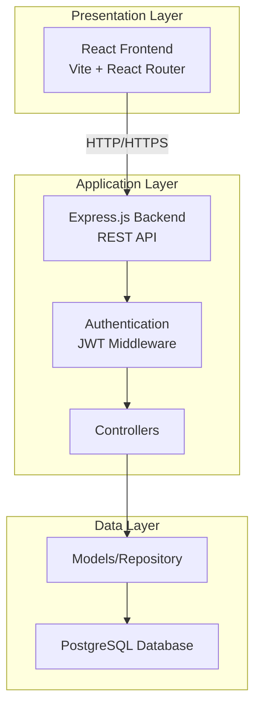

# Smart Parking Management System

## 🚗 Project Overview

**Topic**: Smart Parking Management System  
**Case Study**: University Campus Parking Management

This project addresses the real-world problem of inefficient parking management in university campuses, where students and staff struggle to find available parking spots, leading to time waste, congestion, and frustration. Our Smart Parking Management System provides a digital solution that allows users to view available parking lots, make reservations, and process payments seamlessly.

## 📋 Table of Contents

- [Problem Statement](#problem-statement)
- [Solution](#solution)
- [Features](#features)
- [Technology Stack](#technology-stack)
- [System Architecture](#system-architecture)
- [Getting Started](#getting-started)
- [Documentation](#documentation)
- [Design Patterns](#design-patterns)
- [Testing](#testing)
- [Docker Deployment](#docker-deployment)
- [License](#license)

## 🎯 Problem Statement

University campuses face several parking-related challenges:

1. **Lack of Real-Time Information**: Students and staff don't know which parking lots have available spaces
2. **Time Wastage**: Drivers spend significant time searching for parking spots
3. **Inefficient Space Utilization**: Parking lots are not optimally utilized
4. **Manual Payment Systems**: Traditional payment methods are slow and inconvenient
5. **No Reservation System**: Users cannot reserve parking spots in advance for important events

## 💡 Solution

Our Smart Parking Management System provides:

- **Real-Time Availability**: Live updates on available parking slots across campus
- **Online Reservations**: Users can reserve parking spots in advance
- **Digital Payments**: Secure online payment processing with QR code receipts
- **Admin Dashboard**: Comprehensive management tools for parking lot administrators
- **Reports & Analytics**: Data-driven insights on parking usage and revenue

## ✨ Features

### For Drivers (Students/Staff)

- 🔐 User registration and authentication
- 🅿️ View all parking lots with real-time availability
- 📅 Reserve parking slots for specific time periods
- 💳 Online payment processing (Mobile Money, Credit Card)
- 📱 QR code receipts for verification
- 📊 View reservation history and status

### For Administrators

- 📈 Dashboard with key metrics and analytics
- 🏢 Manage parking lots (create, update, delete)
- 📋 View and manage all reservations
- 💰 Financial reports and revenue tracking
- 📊 Usage statistics and trends

## 🛠️ Technology Stack

### Backend
- **Runtime**: Node.js (v18+)
- **Framework**: Express.js v5
- **Database**: PostgreSQL
- **Authentication**: JWT (JSON Web Tokens)
- **Password Hashing**: bcryptjs
- **Environment Management**: dotenv

### Frontend
- **Framework**: React 18
- **Build Tool**: Vite
- **Routing**: React Router v6
- **UI Framework**: React Bootstrap 5
- **HTTP Client**: Axios
- **Charts**: Recharts
- **Notifications**: React Toastify

### Development & Deployment
- **Version Control**: Git & GitHub
- **Containerization**: Docker & Docker Compose
- **Testing**: Jest (Backend), React Testing Library (Frontend)
- **Code Quality**: ESLint
- **API Documentation**: Swagger/OpenAPI

## 🏗️ System Architecture

The system follows a **three-tier architecture**:



### Design Patterns Used

1. **MVC (Model-View-Controller)**: Separates business logic, data, and presentation
2. **Repository Pattern**: Abstracts data access logic in models
3. **Factory Pattern**: Database connection management
4. **Singleton Pattern**: Configuration management
5. **Middleware Pattern**: Express middleware chain for authentication, validation, and error handling

For detailed architecture documentation, see [docs/ARCHITECTURE.md](docs/ARCHITECTURE.md).

## 🚀 Getting Started

### Prerequisites

- Node.js (v18 or higher)
- PostgreSQL (v14 or higher)
- npm or yarn package manager
- Git

### Installation

1. **Clone the repository**
   ```bash
   git clone <repository-url>
   cd parking-system-main
   ```

2. **Set up the database**
   ```bash
   # Create PostgreSQL database
   createdb parking_system
   
   # Run migrations
   psql -d parking_system -f parking-backend/database/migrations/001_initial_schema.sql
   
   # (Optional) Load seed data
   psql -d parking_system -f parking-backend/database/seeds/001_seed_data.sql
   ```

3. **Configure environment variables**
   
   Create `.env` file in `parking-backend/`:
   ```env
   PORT=5000
   DB_USER=your_db_user
   DB_HOST=localhost
   DB_NAME=parking_system
   DB_PASSWORD=your_db_password
   DB_PORT=5432
   JWT_SECRET=your_super_secret_jwt_key_change_this_in_production
   ```

4. **Install backend dependencies**
   ```bash
   cd parking-backend
   npm install
   ```

5. **Install frontend dependencies**
   ```bash
   cd ../parking-frontend
   npm install
   ```

6. **Run the application**
   
   Terminal 1 (Backend):
   ```bash
   cd parking-backend
   npm run dev
   ```
   
   Terminal 2 (Frontend):
   ```bash
   cd parking-frontend
   npm run dev
   ```

7. **Access the application**
   - Frontend: http://localhost:3000
   - Backend API: http://localhost:5000

### Default Admin Account (if using seed data)

- Email: `admin@parking.com`
- Password: `admin123`

## 📚 Documentation

Comprehensive documentation is available in the `docs/` directory:

- [Architecture Documentation](docs/ARCHITECTURE.md) - System design and component interactions
- [API Documentation](docs/API.md) - Complete REST API reference
- [Database Schema](docs/DATABASE.md) - Database structure and relationships
- [Design Patterns](docs/DESIGN_PATTERNS.md) - Patterns used and implementation details
- [Testing Guide](docs/TESTING.md) - Testing strategy and coverage
- [Docker Guide](docs/DOCKER.md) - Containerization and deployment
- [Git Workflow](docs/GIT_WORKFLOW.md) - Version control practices
- [Deployment Guide](docs/DEPLOYMENT.md) - Production deployment instructions
- [User Manual](docs/USER_MANUAL.md) - End-user guide

### Diagrams

- [Activity Diagrams](docs/diagrams/activity-diagram.md)
- [Data Flow Diagrams](docs/diagrams/data-flow-diagram.md)
- [Sequence Diagrams](docs/diagrams/sequence-diagram.md)

## 🎨 Design Patterns

This project implements several software design patterns following industry best practices:

### 1. MVC (Model-View-Controller)
- **Models**: Data access layer (`parking-backend/models/`)
- **Views**: React components (`parking-frontend/src/`)
- **Controllers**: Business logic (`parking-backend/controllers/`)

### 2. Repository Pattern
- Abstracts database operations in model files
- Provides clean interface for data access
- Example: `UserModel`, `ParkingLotModel`, `ReservationModel`

### 3. Factory Pattern
- Database connection factory in `config/db.js`
- Creates and manages PostgreSQL connection pool

### 4. Singleton Pattern
- Configuration manager ensures single instance
- Centralized environment variable access

### 5. Middleware Pattern
- Express middleware chain for cross-cutting concerns
- Authentication, validation, error handling, logging

See [docs/DESIGN_PATTERNS.md](docs/DESIGN_PATTERNS.md) for detailed implementation.

## 🧪 Testing

The project includes comprehensive test coverage:

### Backend Testing

```bash
cd parking-backend

# Run all tests
npm test

# Run with coverage
npm run test:coverage

# Run integration tests
npm run test:integration

# Watch mode
npm run test:watch
```

### Frontend Testing

```bash
cd parking-frontend

# Run component tests
npm test

# Run with coverage
npm run test:coverage
```

### Test Coverage Goals

- **Backend**: >80% code coverage
- **Frontend**: >70% component coverage
- **Integration**: All critical user flows tested

See [docs/TESTING.md](docs/TESTING.md) for detailed testing documentation.

## 🐳 Docker Deployment

The application is fully containerized for easy deployment:

### Quick Start with Docker

```bash
# Build and start all services
docker-compose up -d

# View logs
docker-compose logs -f

# Stop services
docker-compose down
```

### Services

- **Frontend**: http://localhost:3000
- **Backend API**: http://localhost:5000
- **PostgreSQL**: localhost:5432

### Development Mode

```bash
# Use development compose file with hot reload
docker-compose -f docker-compose.dev.yml up
```

See [docs/DOCKER.md](docs/DOCKER.md) for detailed Docker documentation.

## 📁 Project Structure

```
parking-system-main/
├── parking-backend/           # Node.js/Express backend
│   ├── config/               # Configuration files
│   ├── controllers/          # Request handlers
│   ├── database/             # Migrations and seeds
│   ├── middleware/           # Express middleware
│   ├── models/               # Data access layer
│   ├── routes/               # API routes
│   ├── tests/                # Backend tests
│   ├── utils/                # Utility functions
│   ├── Dockerfile            # Backend container
│   └── package.json
│
├── parking-frontend/         # React frontend
│   ├── public/               # Static assets
│   ├── src/
│   │   ├── api/             # API client
│   │   ├── components/      # Reusable components
│   │   ├── context/         # React context
│   │   ├── pages/           # Page components
│   │   ├── styles/          # CSS files
│   │   └── tests/           # Frontend tests
│   ├── Dockerfile           # Frontend container
│   └── package.json
│
├── docs/                     # Documentation
│   └── diagrams/            # System diagrams
│
├── presentation/             # PowerPoint materials
├── docker-compose.yml        # Docker orchestration
└── README.md                # This file
```

## 🔒 Security Best Practices

- ✅ JWT-based authentication
- ✅ Password hashing with bcrypt
- ✅ SQL injection prevention (parameterized queries)
- ✅ CORS configuration
- ✅ Environment variable protection
- ✅ Rate limiting on API endpoints
- ✅ Helmet.js security headers
- ✅ Input validation and sanitization

## 🤝 Contributing

This is an academic project for final exam purposes. For any questions or suggestions, please contact the project maintainer.

## 📄 License

This project is developed as part of a university final exam requirement.

## 👥 Author

**Student Name**: [Your Name]  
**Course**: [Your Course]  
**Institution**: [Your University]  
**Year**: 2025

## 🙏 Acknowledgments

- Express.js and React communities
- PostgreSQL documentation
- Google's coding standards
- Open source contributors

---

**Note**: This project demonstrates proficiency in:
- Full-stack web development
- Database design and management
- RESTful API development
- Modern frontend frameworks
- Software design patterns
- Testing and quality assurance
- Containerization and deployment
- Version control and collaboration
