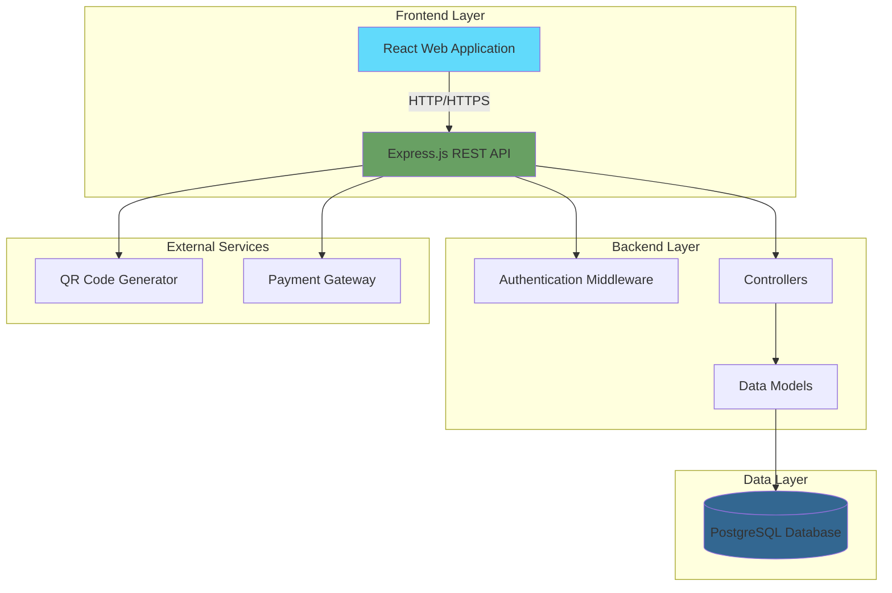

# Smart Parking Management System - Complete Documentation

## Table of Contents
1. [System Overview](#system-overview)
2. [Architecture](#architecture)
3. [User Roles & Features](#user-roles--features)
4. [System Workflows](#system-workflows)
5. [Database Schema](#database-schema)
6. [API Endpoints](#api-endpoints)
7. [Technology Stack](#technology-stack)
8. [Setup & Deployment](#setup--deployment)

---

## System Overview

The **Smart Parking Management System** is a web-based application that allows users to find, reserve, and pay for parking spots in real-time. The system provides separate interfaces for drivers and administrators.

### Key Features
- 🚗 Real-time parking availability tracking
- 📅 Advance parking reservations
- 💳 Integrated payment processing
- 📊 Admin dashboard with analytics
- 🔐 Secure authentication system
- 📱 Responsive design for mobile and desktop

---

## Architecture

### System Architecture Diagram



### Component Architecture


---

## User Roles & Features

### 1. Driver (Regular User)

**Capabilities:**
- ✅ Register and login to the system
- ✅ Browse available parking lots
- ✅ View real-time slot availability
- ✅ Create parking reservations
- ✅ Make payments for reservations
- ✅ View reservation history
- ✅ Cancel unpaid reservations
- ✅ Download payment receipts with QR codes

**Restrictions:**
- ❌ Cannot cancel paid reservations
- ❌ Cannot access admin features
- ❌ Cannot modify parking lot information

### 2. Administrator

**Capabilities:**
- ✅ All driver capabilities
- ✅ Create and manage parking lots
- ✅ View all reservations across the system
- ✅ View revenue analytics
- ✅ Mark reservations as completed
- ✅ Monitor system usage statistics

---

## System Workflows

### 1. User Registration & Login Flow


### 2. Parking Reservation Flow


### 3. Payment Processing Flow


### 4. Reservation Lifecycle


---

## Database Schema

### Entity Relationship Diagram


### Table Details

#### Users Table
| Column | Type | Constraints | Description |
|--------|------|-------------|-------------|
| id | SERIAL | PRIMARY KEY | Unique user identifier |
| name | VARCHAR(255) | NOT NULL | User's full name |
| email | VARCHAR(255) | UNIQUE, NOT NULL | Login email |
| password | VARCHAR(255) | NOT NULL | Hashed password |
| role | VARCHAR(50) | DEFAULT 'driver' | User role (driver/admin) |
| phone_number | VARCHAR(20) | - | Contact number |
| created_at | TIMESTAMP | DEFAULT NOW() | Account creation time |

#### Parking Lots Table
| Column | Type | Constraints | Description |
|--------|------|-------------|-------------|
| id | SERIAL | PRIMARY KEY | Unique lot identifier |
| name | VARCHAR(255) | NOT NULL | Parking lot name |
| location | TEXT | NOT NULL | Physical address |
| total_slots | INTEGER | NOT NULL, > 0 | Total parking spaces |
| available_slots | INTEGER | NOT NULL, >= 0 | Currently available spaces |
| created_at | TIMESTAMP | DEFAULT NOW() | Creation time |

#### Reservations Table
| Column | Type | Constraints | Description |
|--------|------|-------------|-------------|
| id | SERIAL | PRIMARY KEY | Unique reservation ID |
| user_id | INTEGER | FK → users(id) | Who made the reservation |
| lot_id | INTEGER | FK → parking_lots(id) | Which parking lot |
| slot_number | VARCHAR(50) | - | Specific slot (optional) |
| start_time | TIMESTAMP | NOT NULL | Reservation start |
| end_time | TIMESTAMP | NOT NULL | Reservation end |
| status | VARCHAR(50) | CHECK constraint | Current status |
| created_at | TIMESTAMP | DEFAULT NOW() | Booking time |

**Status Values:** `booked`, `active`, `paid`, `completed`, `cancelled`

#### Payments Table
| Column | Type | Constraints | Description |
|--------|------|-------------|-------------|
| id | SERIAL | PRIMARY KEY | Unique payment ID |
| reservation_id | INTEGER | FK → reservations(id) | Associated reservation |
| amount | DECIMAL(10,2) | NOT NULL, > 0 | Payment amount |
| method | VARCHAR(50) | CHECK constraint | Payment method |
| status | VARCHAR(50) | DEFAULT 'pending' | Payment status |
| transaction_code | VARCHAR(255) | UNIQUE | Transaction reference |
| payment_time | TIMESTAMP | - | When payment completed |
| created_at | TIMESTAMP | DEFAULT NOW() | Record creation time |

**Method Values:** `mobile_money`, `credit_card`, `cash`  
**Status Values:** `pending`, `paid`, `failed`, `refunded`

---

## API Endpoints

### Authentication Endpoints

| Method | Endpoint | Description | Auth Required |
|--------|----------|-------------|---------------|
| POST | `/api/auth/register` | Register new user | No |
| POST | `/api/auth/login` | Login user | No |
| GET | `/api/auth/me` | Get current user | Yes |

### Parking Lots Endpoints

| Method | Endpoint | Description | Auth Required | Role |
|--------|----------|-------------|---------------|------|
| GET | `/api/parking-lots` | Get all parking lots | Yes | Any |
| GET | `/api/parking-lots/:id` | Get specific lot | Yes | Any |
| POST | `/api/parking-lots` | Create new lot | Yes | Admin |
| PUT | `/api/parking-lots/:id` | Update lot | Yes | Admin |
| DELETE | `/api/parking-lots/:id` | Delete lot | Yes | Admin |

### Reservations Endpoints

| Method | Endpoint | Description | Auth Required | Role |
|--------|----------|-------------|---------------|------|
| GET | `/api/reservations/my` | Get my reservations | Yes | Driver |
| GET | `/api/reservations/all` | Get all reservations | Yes | Admin |
| POST | `/api/reservations` | Create reservation | Yes | Driver |
| PUT | `/api/reservations/:id/cancel` | Cancel reservation | Yes | Any |
| PUT | `/api/reservations/:id/complete` | Mark as completed | Yes | Admin |

### Payments Endpoints

| Method | Endpoint | Description | Auth Required |
|--------|----------|-------------|---------------|
| POST | `/api/payments` | Process payment | Yes |
| GET | `/api/payments/by-reservation/:id` | Get payments for reservation | Yes |

---

## Technology Stack

### Frontend
- **Framework**: React 18
- **Routing**: React Router v6
- **UI Library**: React Bootstrap
- **HTTP Client**: Axios
- **Notifications**: React Toastify
- **Build Tool**: Vite

### Backend
- **Runtime**: Node.js
- **Framework**: Express.js
- **Authentication**: JWT (jsonwebtoken)
- **Password Hashing**: bcrypt
- **Database Client**: node-postgres (pg)
- **QR Code**: qrcode library
- **Environment**: dotenv

### Database
- **DBMS**: PostgreSQL 14+
- **Features Used**:
  - Transactions
  - Row-level locking
  - CHECK constraints
  - Foreign keys with CASCADE/RESTRICT

### DevOps
- **Containerization**: Docker & Docker Compose
- **Version Control**: Git
- **Repository**: GitHub

---

## Setup & Deployment

### Prerequisites
- Node.js 16+ and npm
- PostgreSQL 14+
- Git

### Local Development Setup

#### 1. Clone Repository
```bash
git clone https://github.com/ManziLeila/Parking-managment-system.git
cd Parking-managment-system
```

#### 2. Backend Setup
```bash
cd parking-backend
npm install

# Create .env file
cp .env.example .env
# Edit .env with your database credentials

# Run migrations
node migrate.js

# Seed data (optional)
node seed.js

# Start development server
npm run dev
```

#### 3. Frontend Setup
```bash
cd parking-frontend
npm install

# Start development server
npm run dev
```

#### 4. Access Application
- Frontend: http://localhost:5173
- Backend API: http://localhost:3000

### Docker Deployment

```bash
# Start all services
docker-compose up -d

# View logs
docker-compose logs -f

# Stop services
docker-compose down
```

### Environment Variables

**Backend (.env)**
```env
PORT=3000
DB_HOST=localhost
DB_PORT=5432
DB_NAME=parking_system
DB_USER=postgres
DB_PASSWORD=your_password
JWT_SECRET=your_jwt_secret_key
```

**Frontend (.env)**
```env
VITE_API_URL=http://localhost:3000
```

---

## Key Business Rules

### Reservation Rules
1. ✅ Reservations can only be created if slots are available
2. ✅ End time must be after start time
3. ✅ Slot count decrements atomically when reservation is created
4. ✅ Only unpaid reservations can be cancelled
5. ✅ Cancelling returns the slot to available pool

### Payment Rules
1. ✅ Payment immediately updates reservation status to 'paid'
2. ✅ Paid reservations cannot be cancelled
3. ✅ Each payment generates a unique QR code receipt
4. ✅ Transaction codes are unique across all payments

### Security Rules
1. ✅ All passwords are hashed with bcrypt
2. ✅ JWT tokens expire after configured time
3. ✅ Admin-only endpoints check user role
4. ✅ Users can only view/modify their own reservations
5. ✅ Database uses row-level locking for concurrent access

---

## System Statistics & Analytics

The admin dashboard provides:
- 📊 Total revenue (daily, weekly, monthly)
- 🚗 Active reservations count
- 💰 Revenue per parking lot
- 📈 Booking trends over time
- 👥 User registration statistics

---

## Future Enhancements

Potential improvements:
- 🔔 Email/SMS notifications
- 📱 Mobile app (React Native)
- 🗺️ Map integration for parking lot locations
- ⭐ User ratings and reviews
- 🎫 Loyalty program
- 📊 Advanced analytics and reporting
- 🔄 Recurring reservations
- 💳 Multiple payment gateway integration

---

## Support & Maintenance

### Common Issues

**Issue**: Cannot connect to database  
**Solution**: Check PostgreSQL is running and .env credentials are correct

**Issue**: Port already in use  
**Solution**: Change PORT in .env or kill process using the port

**Issue**: Payment fails  
**Solution**: Check database migration 002_add_paid_status.sql was run

### Logs Location
- Backend: Console output (development) or log files (production)
- Frontend: Browser console
- Database: PostgreSQL logs

---

## License

This project is developed for educational purposes as part of a final exam project.

---

## Contributors

- **Developer**: ManziLeila
- **Repository**: https://github.com/ManziLeila/Parking-managment-system

---

*Last Updated: December 12, 2025*
