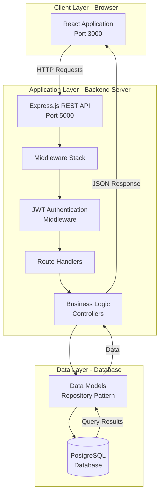
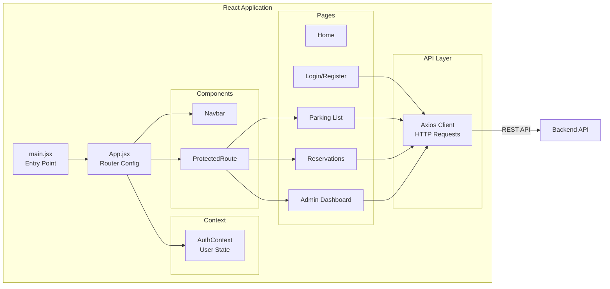
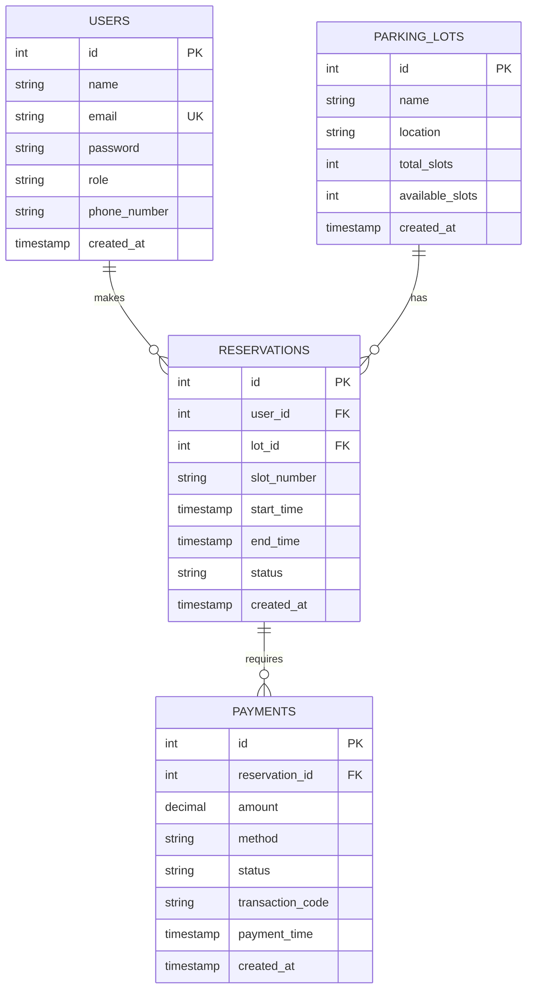
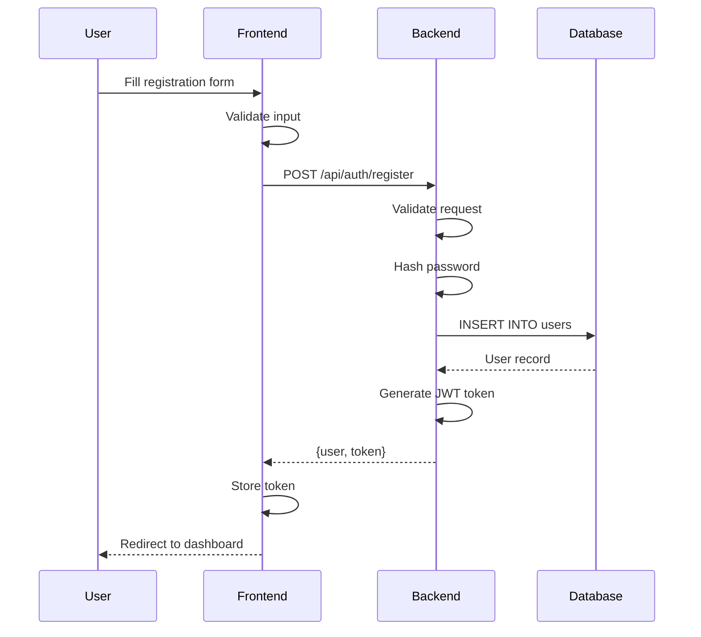
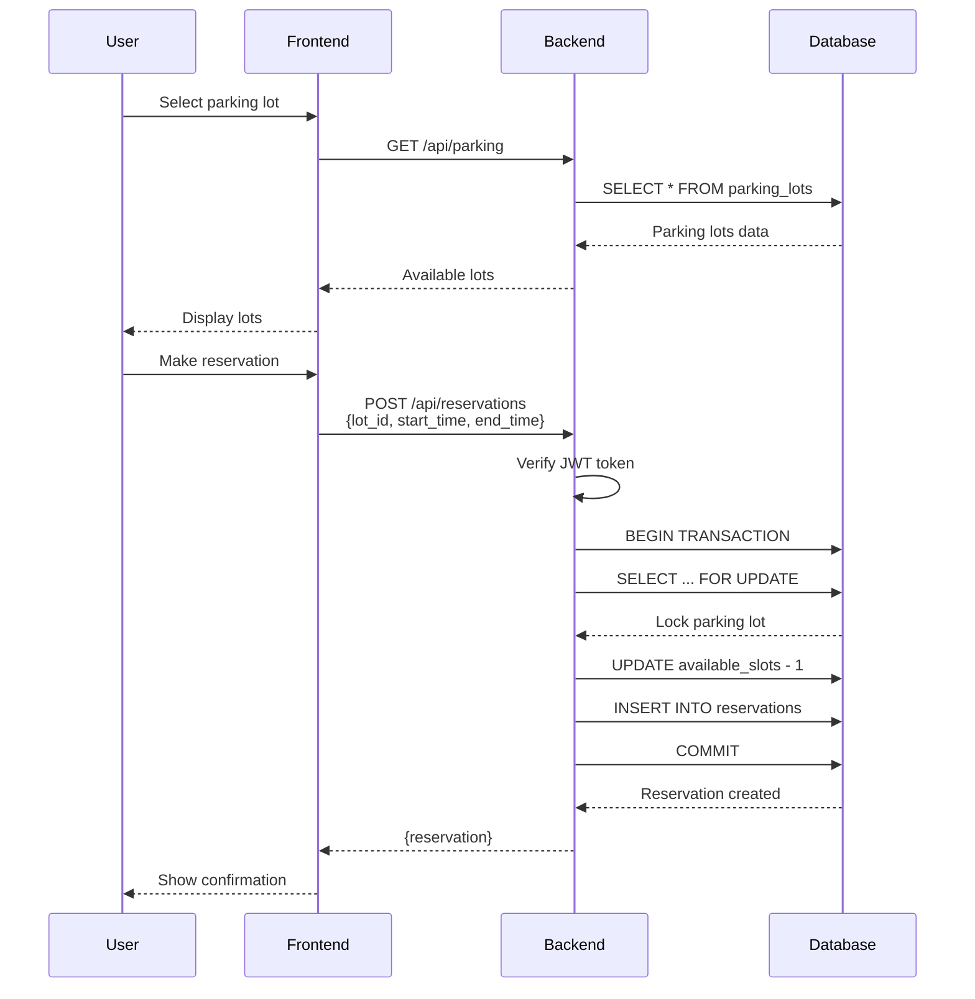
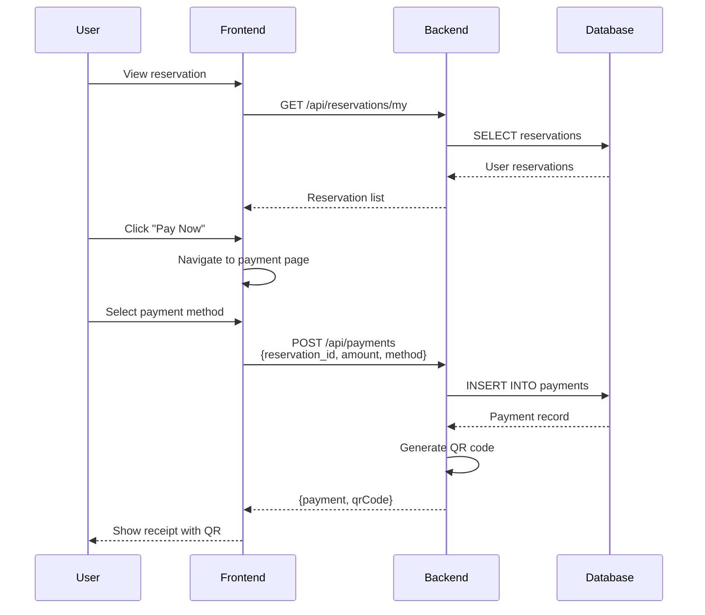
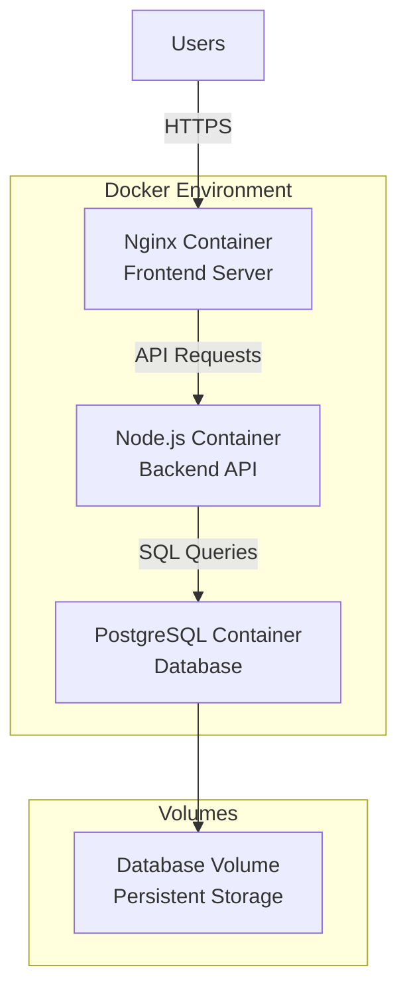

# System Architecture Documentation

## Overview

The Smart Parking Management System is built using a modern three-tier architecture that separates concerns and promotes maintainability, scalability, and testability.

## Architecture Diagram



## Component Architecture

### Frontend Architecture (React)



### Backend Architecture (Express.js)

```mermaid
graph TB
    REQUEST[Incoming HTTP Request]
    
    subgraph "Middleware Stack"
        CORS[CORS Handler]
        HELMET[Security Headers]
        JSON[JSON Parser]
        RATE[Rate Limiter]
        LOG[Request Logger]
    end
    
    subgraph "Route Layer"
        AUTH_ROUTE[/api/auth]
        PARKING_ROUTE[/api/parking]
        RESERVE_ROUTE[/api/reservations]
        PAYMENT_ROUTE[/api/payments]
        REPORT_ROUTE[/api/reports]
    end
    
    subgraph "Authentication"
        JWT_VERIFY[JWT Verification]
        ROLE_CHECK[Role Authorization]
    end
    
    subgraph "Controller Layer"
        AUTH_CTRL[AuthController]
        PARKING_CTRL[ParkingLotController]
        RESERVE_CTRL[ReservationController]
        PAYMENT_CTRL[PaymentController]
        REPORT_CTRL[ReportController]
    end
    
    subgraph "Model Layer"
        USER_MODEL[UserModel]
        LOT_MODEL[ParkingLotModel]
        RESERVE_MODEL[ReservationModel]
        PAYMENT_MODEL[PaymentModel]
    end
    
    subgraph "Database"
        POOL[Connection Pool]
        POSTGRES[(PostgreSQL)]
    end
    
    ERROR[Error Handler]
    RESPONSE[JSON Response]
    
    REQUEST --> CORS
    CORS --> HELMET
    HELMET --> JSON
    JSON --> RATE
    RATE --> LOG
    LOG --> AUTH_ROUTE
    LOG --> PARKING_ROUTE
    LOG --> RESERVE_ROUTE
    LOG --> PAYMENT_ROUTE
    LOG --> REPORT_ROUTE
    
    PARKING_ROUTE --> JWT_VERIFY
    RESERVE_ROUTE --> JWT_VERIFY
    PAYMENT_ROUTE --> JWT_VERIFY
    REPORT_ROUTE --> JWT_VERIFY
    
    JWT_VERIFY --> ROLE_CHECK
    ROLE_CHECK --> AUTH_CTRL
    ROLE_CHECK --> PARKING_CTRL
    ROLE_CHECK --> RESERVE_CTRL
    ROLE_CHECK --> PAYMENT_CTRL
    ROLE_CHECK --> REPORT_CTRL
    
    AUTH_CTRL --> USER_MODEL
    PARKING_CTRL --> LOT_MODEL
    RESERVE_CTRL --> RESERVE_MODEL
    PAYMENT_CTRL --> PAYMENT_MODEL
    REPORT_CTRL --> PAYMENT_MODEL
    
    USER_MODEL --> POOL
    LOT_MODEL --> POOL
    RESERVE_MODEL --> POOL
    PAYMENT_MODEL --> POOL
    
    POOL --> POSTGRES
    
    AUTH_CTRL --> RESPONSE
    PARKING_CTRL --> RESPONSE
    RESERVE_CTRL --> RESPONSE
    PAYMENT_CTRL --> RESPONSE
    REPORT_CTRL --> RESPONSE
    
    AUTH_CTRL -.Error.-> ERROR
    PARKING_CTRL -.Error.-> ERROR
    ERROR --> RESPONSE
```

## Database Schema



## Data Flow

### User Registration Flow



### Parking Reservation Flow



### Payment Processing Flow



## Technology Stack Details

### Backend Technologies

| Technology | Version | Purpose |
|------------|---------|---------|
| Node.js | 18+ | JavaScript runtime |
| Express.js | 5.1.0 | Web framework |
| PostgreSQL | 14+ | Relational database |
| pg | 8.16.3 | PostgreSQL client |
| jsonwebtoken | 9.0.2 | JWT authentication |
| bcryptjs | 3.0.2 | Password hashing |
| cors | 2.8.5 | Cross-origin requests |
| dotenv | 17.2.1 | Environment variables |
| qrcode | 1.5.4 | QR code generation |
| dayjs | 1.11.13 | Date manipulation |

### Frontend Technologies

| Technology | Version | Purpose |
|------------|---------|---------|
| React | 18.3.1 | UI library |
| Vite | 5.4.10 | Build tool |
| React Router | 6.26.2 | Client-side routing |
| Axios | 1.7.7 | HTTP client |
| Bootstrap | 5.3.3 | CSS framework |
| React Bootstrap | 2.10.6 | React components |
| Recharts | 2.13.3 | Charts and graphs |
| React Toastify | 10.0.5 | Notifications |
| jwt-decode | 4.0.0 | JWT parsing |

## Design Patterns Implementation

### 1. MVC Pattern

**Model**: Data access layer
- `models/userModel.js`
- `models/parkingLotModel.js`
- `models/reservationModel.js`
- `models/paymentModel.js`

**View**: React components
- `pages/` - Page components
- `components/` - Reusable UI components

**Controller**: Business logic
- `controllers/authController.js`
- `controllers/parkingLotController.js`
- `controllers/reservationController.js`
- `controllers/paymentController.js`

### 2. Repository Pattern

Models act as repositories, abstracting database operations:

```javascript
// Example: UserModel as Repository
const UserModel = {
  async findByEmail(email) { /* ... */ },
  async findById(id) { /* ... */ },
  async create(userData) { /* ... */ }
};
```

### 3. Factory Pattern

Database connection factory:

```javascript
// config/db.js - Factory for creating connections
const pool = new Pool(config);
module.exports = pool; // Single pool instance
```

### 4. Middleware Pattern

Express middleware chain:

```javascript
app.use(cors());           // CORS handling
app.use(express.json());   // JSON parsing
app.use(authenticate);     // JWT verification
app.use(authorize);        // Role-based access
app.use(errorHandler);     // Error handling
```

### 5. Singleton Pattern

Configuration manager ensures single instance:

```javascript
class ConfigManager {
  static instance;
  
  static getInstance() {
    if (!ConfigManager.instance) {
      ConfigManager.instance = new ConfigManager();
    }
    return ConfigManager.instance;
  }
}
```

## Security Architecture

### Authentication Flow

```mermaid
graph LR
    LOGIN[User Login] --> VALIDATE[Validate Credentials]
    VALIDATE --> HASH[Compare Password Hash]
    HASH --> TOKEN[Generate JWT Token]
    TOKEN --> STORE[Store in LocalStorage]
    STORE --> REQUEST[Include in Requests]
    REQUEST --> VERIFY[Verify JWT]
    VERIFY --> AUTHORIZE[Check Role]
    AUTHORIZE --> ACCESS[Grant Access]
```



### Security Measures

1. **Password Security**
   - Bcrypt hashing with salt rounds
   - Never store plain text passwords

2. **JWT Authentication**
   - Signed tokens with secret key
   - 7-day expiration
   - Role-based claims

3. **SQL Injection Prevention**
   - Parameterized queries
   - No string concatenation

4. **CORS Configuration**
   - Controlled origin access
   - Credential handling

5. **Rate Limiting**
   - Prevent brute force attacks
   - API abuse protection

## Scalability Considerations

### Horizontal Scaling

- Stateless API design
- JWT tokens (no session storage)
- Database connection pooling
- Load balancer ready

### Vertical Scaling

- Efficient database queries
- Indexed columns
- Connection pool optimization
- Caching strategies

### Database Optimization

- Indexes on foreign keys
- Transaction management
- Row-level locking for concurrency
- Query optimization

## Deployment Architecture



## Monitoring and Logging

### Logging Strategy

- **Request Logging**: All API requests logged
- **Error Logging**: Stack traces and error details
- **Database Logging**: Query performance tracking
- **Authentication Logging**: Login attempts and failures

### Log Levels

- `ERROR`: Application errors
- `WARN`: Warning conditions
- `INFO`: Informational messages
- `DEBUG`: Debugging information

## Performance Optimization

1. **Frontend**
   - Code splitting with React Router
   - Lazy loading components
   - Optimized bundle size with Vite
   - Asset compression

2. **Backend**
   - Connection pooling
   - Efficient database queries
   - Response caching
   - Compression middleware

3. **Database**
   - Proper indexing
   - Query optimization
   - Connection pooling
   - Transaction management

## Future Enhancements

- Real-time updates with WebSockets
- Mobile application (React Native)
- Payment gateway integration
- IoT sensor integration
- Machine learning for demand prediction
- Multi-language support
- Advanced analytics dashboard

---

**Last Updated**: December 2025  
**Version**: 1.0.0
