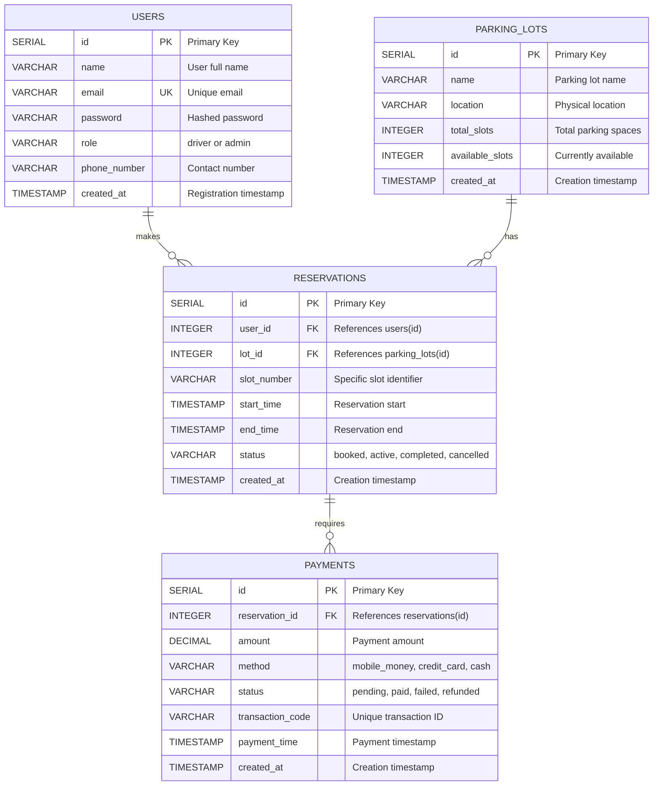

# Database Schema Documentation

## Overview

The Smart Parking Management System uses **PostgreSQL** as its relational database. The schema is designed to support user authentication, parking lot management, reservations, and payment processing.

## Entity-Relationship Diagram



## Table Specifications

### 1. Users Table

Stores user account information for both drivers and administrators.

```sql
CREATE TABLE users (
    id SERIAL PRIMARY KEY,
    name VARCHAR(255) NOT NULL,
    email VARCHAR(255) UNIQUE NOT NULL,
    password VARCHAR(255) NOT NULL,  -- bcrypt hashed
    role VARCHAR(50) DEFAULT 'driver' CHECK (role IN ('driver', 'admin')),
    phone_number VARCHAR(20),
    created_at TIMESTAMP DEFAULT CURRENT_TIMESTAMP
);

CREATE INDEX idx_users_email ON users(email);
CREATE INDEX idx_users_role ON users(role);
```

**Columns**:
- `id`: Auto-incrementing primary key
- `name`: User's full name
- `email`: Unique email address (used for login)
- `password`: Bcrypt hashed password (never stored in plain text)
- `role`: User role - either 'driver' (default) or 'admin'
- `phone_number`: Optional contact number
- `created_at`: Account creation timestamp

**Constraints**:
- `email` must be unique
- `role` must be either 'driver' or 'admin'

**Indexes**:
- Index on `email` for fast login lookups
- Index on `role` for role-based queries

---

### 2. Parking Lots Table

Stores information about parking facilities.

```sql
CREATE TABLE parking_lots (
    id SERIAL PRIMARY KEY,
    name VARCHAR(255) NOT NULL,
    location TEXT NOT NULL,
    total_slots INTEGER NOT NULL CHECK (total_slots > 0),
    available_slots INTEGER NOT NULL CHECK (available_slots >= 0),
    created_at TIMESTAMP DEFAULT CURRENT_TIMESTAMP,
    CONSTRAINT check_available_slots CHECK (available_slots <= total_slots)
);

CREATE INDEX idx_parking_lots_available ON parking_lots(available_slots);
```

**Columns**:
- `id`: Auto-incrementing primary key
- `name`: Parking lot name (e.g., "Main Campus Parking")
- `location`: Physical location description
- `total_slots`: Total number of parking spaces
- `available_slots`: Currently available spaces
- `created_at`: Creation timestamp

**Constraints**:
- `total_slots` must be greater than 0
- `available_slots` must be non-negative
- `available_slots` cannot exceed `total_slots`

**Indexes**:
- Index on `available_slots` for availability queries

**Business Logic**:
- When a reservation is created, `available_slots` is decremented
- When a reservation is cancelled, `available_slots` is incremented
- Updates use row-level locking to prevent race conditions

---

### 3. Reservations Table

Stores parking reservations made by users.

```sql
CREATE TABLE reservations (
    id SERIAL PRIMARY KEY,
    user_id INTEGER NOT NULL REFERENCES users(id) ON DELETE CASCADE,
    lot_id INTEGER NOT NULL REFERENCES parking_lots(id) ON DELETE RESTRICT,
    slot_number VARCHAR(50),
    start_time TIMESTAMP NOT NULL,
    end_time TIMESTAMP NOT NULL,
    status VARCHAR(50) DEFAULT 'booked' CHECK (status IN ('booked', 'active', 'completed', 'cancelled')),
    created_at TIMESTAMP DEFAULT CURRENT_TIMESTAMP,
    CONSTRAINT check_time_range CHECK (end_time > start_time)
);

CREATE INDEX idx_reservations_user ON reservations(user_id);
CREATE INDEX idx_reservations_lot ON reservations(lot_id);
CREATE INDEX idx_reservations_status ON reservations(status);
CREATE INDEX idx_reservations_time ON reservations(start_time, end_time);
```

**Columns**:
- `id`: Auto-incrementing primary key
- `user_id`: Foreign key to users table
- `lot_id`: Foreign key to parking_lots table
- `slot_number`: Optional specific slot identifier (e.g., "A12")
- `start_time`: Reservation start timestamp
- `end_time`: Reservation end timestamp
- `status`: Current reservation status
- `created_at`: Creation timestamp

**Status Values**:
- `booked`: Initial state after creation
- `active`: User has checked in
- `completed`: Parking session finished
- `cancelled`: Reservation cancelled by user or admin

**Constraints**:
- `user_id` must reference a valid user
- `lot_id` must reference a valid parking lot
- `end_time` must be after `start_time`
- `status` must be one of the defined values

**Foreign Key Behaviors**:
- `ON DELETE CASCADE` for user_id: If user is deleted, their reservations are deleted
- `ON DELETE RESTRICT` for lot_id: Cannot delete parking lot with active reservations

**Indexes**:
- Index on `user_id` for user's reservation queries
- Index on `lot_id` for lot-specific queries
- Index on `status` for status filtering
- Composite index on time range for availability checks

---

### 4. Payments Table

Stores payment transactions for reservations.

```sql
CREATE TABLE payments (
    id SERIAL PRIMARY KEY,
    reservation_id INTEGER NOT NULL REFERENCES reservations(id) ON DELETE CASCADE,
    amount DECIMAL(10, 2) NOT NULL CHECK (amount > 0),
    method VARCHAR(50) NOT NULL CHECK (method IN ('mobile_money', 'credit_card', 'cash')),
    status VARCHAR(50) DEFAULT 'pending' CHECK (status IN ('pending', 'paid', 'failed', 'refunded')),
    transaction_code VARCHAR(255) UNIQUE,
    payment_time TIMESTAMP,
    created_at TIMESTAMP DEFAULT CURRENT_TIMESTAMP
);

CREATE INDEX idx_payments_reservation ON payments(reservation_id);
CREATE INDEX idx_payments_status ON payments(status);
CREATE INDEX idx_payments_time ON payments(payment_time);
CREATE INDEX idx_payments_transaction ON payments(transaction_code);
```

**Columns**:
- `id`: Auto-incrementing primary key
- `reservation_id`: Foreign key to reservations table
- `amount`: Payment amount in local currency
- `method`: Payment method used
- `status`: Payment status
- `transaction_code`: Unique transaction identifier (UUID)
- `payment_time`: Timestamp when payment was completed
- `created_at`: Record creation timestamp

**Payment Methods**:
- `mobile_money`: Mobile money (e.g., MTN Mobile Money, Airtel Money)
- `credit_card`: Credit/debit card
- `cash`: Cash payment

**Payment Status**:
- `pending`: Payment initiated but not completed
- `paid`: Payment successful
- `failed`: Payment failed
- `refunded`: Payment refunded (after cancellation)

**Constraints**:
- `reservation_id` must reference a valid reservation
- `amount` must be positive
- `transaction_code` must be unique
- `method` and `status` must be valid values

**Indexes**:
- Index on `reservation_id` for payment lookups
- Index on `status` for payment status queries
- Index on `payment_time` for revenue reports
- Index on `transaction_code` for transaction lookups

---

## Relationships

### One-to-Many Relationships

1. **Users → Reservations**
   - One user can have multiple reservations
   - Cascade delete: Deleting a user deletes their reservations

2. **Parking Lots → Reservations**
   - One parking lot can have multiple reservations
   - Restrict delete: Cannot delete lot with existing reservations

3. **Reservations → Payments**
   - One reservation can have multiple payment attempts
   - Cascade delete: Deleting a reservation deletes its payments

## Database Migrations

### Initial Schema Migration

**File**: `parking-backend/database/migrations/001_initial_schema.sql`

```sql
-- Create users table
CREATE TABLE users (
    id SERIAL PRIMARY KEY,
    name VARCHAR(255) NOT NULL,
    email VARCHAR(255) UNIQUE NOT NULL,
    password VARCHAR(255) NOT NULL,
    role VARCHAR(50) DEFAULT 'driver' CHECK (role IN ('driver', 'admin')),
    phone_number VARCHAR(20),
    created_at TIMESTAMP DEFAULT CURRENT_TIMESTAMP
);

CREATE INDEX idx_users_email ON users(email);
CREATE INDEX idx_users_role ON users(role);

-- Create parking_lots table
CREATE TABLE parking_lots (
    id SERIAL PRIMARY KEY,
    name VARCHAR(255) NOT NULL,
    location TEXT NOT NULL,
    total_slots INTEGER NOT NULL CHECK (total_slots > 0),
    available_slots INTEGER NOT NULL CHECK (available_slots >= 0),
    created_at TIMESTAMP DEFAULT CURRENT_TIMESTAMP,
    CONSTRAINT check_available_slots CHECK (available_slots <= total_slots)
);

CREATE INDEX idx_parking_lots_available ON parking_lots(available_slots);

-- Create reservations table
CREATE TABLE reservations (
    id SERIAL PRIMARY KEY,
    user_id INTEGER NOT NULL REFERENCES users(id) ON DELETE CASCADE,
    lot_id INTEGER NOT NULL REFERENCES parking_lots(id) ON DELETE RESTRICT,
    slot_number VARCHAR(50),
    start_time TIMESTAMP NOT NULL,
    end_time TIMESTAMP NOT NULL,
    status VARCHAR(50) DEFAULT 'booked' CHECK (status IN ('booked', 'active', 'completed', 'cancelled')),
    created_at TIMESTAMP DEFAULT CURRENT_TIMESTAMP,
    CONSTRAINT check_time_range CHECK (end_time > start_time)
);

CREATE INDEX idx_reservations_user ON reservations(user_id);
CREATE INDEX idx_reservations_lot ON reservations(lot_id);
CREATE INDEX idx_reservations_status ON reservations(status);
CREATE INDEX idx_reservations_time ON reservations(start_time, end_time);

-- Create payments table
CREATE TABLE payments (
    id SERIAL PRIMARY KEY,
    reservation_id INTEGER NOT NULL REFERENCES reservations(id) ON DELETE CASCADE,
    amount DECIMAL(10, 2) NOT NULL CHECK (amount > 0),
    method VARCHAR(50) NOT NULL CHECK (method IN ('mobile_money', 'credit_card', 'cash')),
    status VARCHAR(50) DEFAULT 'pending' CHECK (status IN ('pending', 'paid', 'failed', 'refunded')),
    transaction_code VARCHAR(255) UNIQUE,
    payment_time TIMESTAMP,
    created_at TIMESTAMP DEFAULT CURRENT_TIMESTAMP
);

CREATE INDEX idx_payments_reservation ON payments(reservation_id);
CREATE INDEX idx_payments_status ON payments(status);
CREATE INDEX idx_payments_time ON payments(payment_time);
CREATE INDEX idx_payments_transaction ON payments(transaction_code);
```

### Seed Data

**File**: `parking-backend/database/seeds/001_seed_data.sql`

```sql
-- Insert admin user (password: admin123)
INSERT INTO users (name, email, password, role, phone_number) VALUES
('Admin User', 'admin@parking.com', '$2a$10$YourHashedPasswordHere', 'admin', '+250788000000');

-- Insert sample parking lots
INSERT INTO parking_lots (name, location, total_slots, available_slots) VALUES
('Main Campus Parking', 'Building A, Ground Floor', 100, 100),
('Faculty Parking', 'Building B, Level 2', 50, 50),
('Student Parking', 'Building C, Outdoor', 150, 150),
('Visitor Parking', 'Main Gate Area', 30, 30);

-- Insert sample driver users
INSERT INTO users (name, email, password, role, phone_number) VALUES
('John Doe', 'john@university.edu', '$2a$10$YourHashedPasswordHere', 'driver', '+250788111111'),
('Jane Smith', 'jane@university.edu', '$2a$10$YourHashedPasswordHere', 'driver', '+250788222222');
```

## Query Examples

### Find Available Parking Lots

```sql
SELECT id, name, location, available_slots, total_slots
FROM parking_lots
WHERE available_slots > 0
ORDER BY available_slots DESC;
```

### Get User's Active Reservations

```sql
SELECT r.*, p.name AS lot_name, p.location
FROM reservations r
JOIN parking_lots p ON p.id = r.lot_id
WHERE r.user_id = $1 
  AND r.status IN ('booked', 'active')
ORDER BY r.start_time ASC;
```

### Calculate Daily Revenue

```sql
SELECT DATE(payment_time) AS date, SUM(amount) AS total_revenue
FROM payments
WHERE status = 'paid'
  AND payment_time >= CURRENT_DATE - INTERVAL '30 days'
GROUP BY DATE(payment_time)
ORDER BY date DESC;
```

### Get Parking Lot Occupancy Rate

```sql
SELECT 
    name,
    total_slots,
    available_slots,
    (total_slots - available_slots) AS occupied_slots,
    ROUND(((total_slots - available_slots)::DECIMAL / total_slots) * 100, 2) AS occupancy_rate
FROM parking_lots
ORDER BY occupancy_rate DESC;
```

## Database Optimization

### Indexing Strategy

1. **Primary Keys**: Automatically indexed
2. **Foreign Keys**: Indexed for join performance
3. **Frequently Queried Columns**: email, status, payment_time
4. **Composite Indexes**: (start_time, end_time) for time range queries

### Connection Pooling

The application uses `pg` connection pooling:

```javascript
const pool = new Pool({
  user: process.env.DB_USER,
  host: process.env.DB_HOST,
  database: process.env.DB_NAME,
  password: process.env.DB_PASSWORD,
  port: process.env.DB_PORT,
  max: 20,  // Maximum pool size
  idleTimeoutMillis: 30000,
  connectionTimeoutMillis: 2000,
});
```

### Transaction Management

Critical operations use transactions with row-level locking:

```javascript
const client = await pool.connect();
try {
  await client.query('BEGIN');
  await client.query('SELECT ... FOR UPDATE');  // Lock row
  // Perform updates
  await client.query('COMMIT');
} catch (e) {
  await client.query('ROLLBACK');
  throw e;
} finally {
  client.release();
}
```

## Backup and Recovery

### Backup Command

```bash
pg_dump -U postgres -d parking_system > backup_$(date +%Y%m%d).sql
```

### Restore Command

```bash
psql -U postgres -d parking_system < backup_20251203.sql
```

---

**Database Version**: PostgreSQL 14+  
**Last Updated**: December 2025
