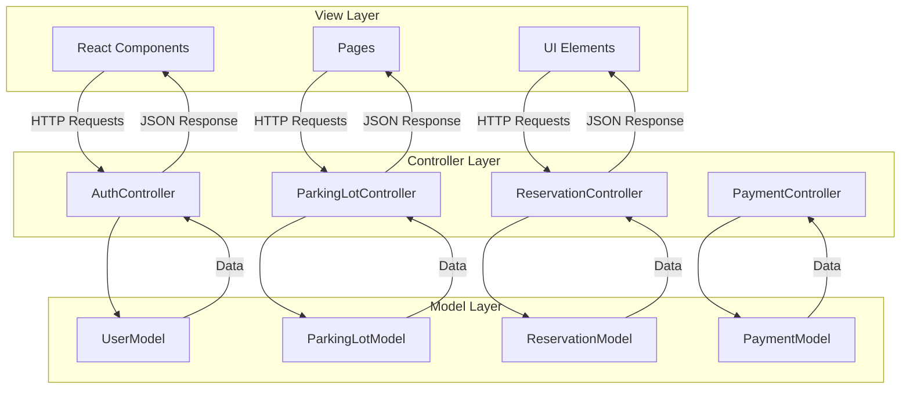
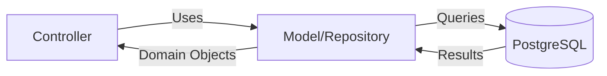
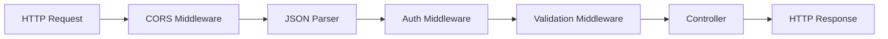

# Design Patterns Documentation

## Overview

The Smart Parking Management System implements several well-established software design patterns to ensure maintainability, scalability, and code quality. This document details each pattern, its implementation, and benefits.

## Table of Contents

1. [MVC (Model-View-Controller)](#1-mvc-model-view-controller)
2. [Repository Pattern](#2-repository-pattern)
3. [Factory Pattern](#3-factory-pattern)
4. [Singleton Pattern](#4-singleton-pattern)
5. [Middleware Pattern](#5-middleware-pattern)
6. [Strategy Pattern](#6-strategy-pattern)

---

## 1. MVC (Model-View-Controller)

### Description

MVC separates the application into three interconnected components, promoting organized code and separation of concerns.

### Implementation



### Code Examples

**Model** (`models/userModel.js`):
```javascript
/**
 * User Model - Data Access Layer
 * Handles all database operations related to users
 */
const pool = require('../config/db');

const UserModel = {
  /**
   * Find user by email address
   * @param {string} email - User's email
   * @returns {Promise<Object|null>} User object or null
   */
  async findByEmail(email) {
    const { rows } = await pool.query(
      'SELECT * FROM users WHERE email = $1 LIMIT 1',
      [email]
    );
    return rows[0];
  },

  /**
   * Create a new user
   * @param {Object} userData - User data
   * @returns {Promise<Object>} Created user object
   */
  async create({ name, email, hashedPassword, role, phone }) {
    const { rows } = await pool.query(
      `INSERT INTO users (name, email, password, role, phone_number)
       VALUES ($1, $2, $3, $4, $5)
       RETURNING id, name, email, role, phone_number, created_at`,
      [name, email, hashedPassword, role || 'driver', phone || null]
    );
    return rows[0];
  }
};

module.exports = UserModel;
```

**Controller** (`controllers/authController.js`):
```javascript
/**
 * Authentication Controller - Business Logic Layer
 * Handles authentication-related business logic
 */
const jwt = require('jsonwebtoken');
const UserModel = require('../models/userModel');
const PasswordUtil = require('../utils/password');

const AuthController = {
  /**
   * Register a new user
   * @route POST /api/auth/register
   */
  async register(req, res) {
    try {
      const { name, email, password, phone, role } = req.body;

      // Validate input
      if (!name || !email || !password) {
        return res.status(400).json({ 
          message: 'Name, email, and password are required' 
        });
      }

      // Check if user exists
      const existing = await UserModel.findByEmail(email);
      if (existing) {
        return res.status(409).json({ 
          message: 'Email already registered' 
        });
      }

      // Hash password
      const hashed = await PasswordUtil.hashPassword(password);

      // Create user
      const user = await UserModel.create({
        name,
        email,
        hashedPassword: hashed,
        role: role || 'driver',
        phone
      });

      // Generate token
      const token = jwt.sign(
        { id: user.id, role: user.role },
        process.env.JWT_SECRET,
        { expiresIn: '7d' }
      );

      return res.status(201).json({ 
        message: 'Registered',
        user,
        token 
      });
    } catch (err) {
      console.error('Register error:', err);
      return res.status(500).json({ message: 'Server error' });
    }
  }
};

module.exports = AuthController;
```

**View** (`pages/Register.jsx`):
```javascript
/**
 * Register Page Component - Presentation Layer
 * Handles user registration UI and interactions
 */
import { useState } from 'react';
import { useNavigate } from 'react-router-dom';
import apiClient from '../api/client';

export default function Register() {
  const [formData, setFormData] = useState({
    name: '',
    email: '',
    password: '',
    phone: ''
  });
  const navigate = useNavigate();

  const handleSubmit = async (e) => {
    e.preventDefault();
    try {
      const response = await apiClient.post('/auth/register', formData);
      localStorage.setItem('token', response.data.token);
      navigate('/dashboard');
    } catch (error) {
      alert(error.response?.data?.message || 'Registration failed');
    }
  };

  return (
    <form onSubmit={handleSubmit}>
      {/* Form fields */}
    </form>
  );
}
```

### Benefits

- ✅ **Separation of Concerns**: Each layer has a single responsibility
- ✅ **Maintainability**: Changes in one layer don't affect others
- ✅ **Testability**: Each component can be tested independently
- ✅ **Reusability**: Models and controllers can be reused across views

---

## 2. Repository Pattern

### Description

The Repository pattern abstracts data access logic, providing a collection-like interface for accessing domain objects.

### Implementation



### Code Example

**Repository Interface** (`models/reservationModel.js`):
```javascript
/**
 * Reservation Repository
 * Provides abstracted data access for reservations
 */
const pool = require('../config/db');

const ReservationModel = {
  /**
   * Find all reservations for a specific user
   * @param {number} userId - User ID
   * @returns {Promise<Array>} Array of reservations
   */
  async findMy(userId) {
    const { rows } = await pool.query(
      `SELECT r.*, p.name AS lot_name, p.location
       FROM reservations r
       JOIN parking_lots p ON p.id = r.lot_id
       WHERE r.user_id = $1
       ORDER BY r.created_at DESC`,
      [userId]
    );
    return rows;
  },

  /**
   * Create reservation with automatic slot decrement
   * Uses transaction to ensure data consistency
   * @param {Object} reservationData - Reservation details
   * @returns {Promise<Object>} Created reservation
   */
  async createWithDecrement({ user_id, lot_id, slot_number, start_time, end_time }) {
    const client = await pool.connect();
    try {
      await client.query('BEGIN');

      // Lock the parking lot row
      const lotRes = await client.query(
        `SELECT id, available_slots FROM parking_lots 
         WHERE id = $1 FOR UPDATE`,
        [lot_id]
      );
      const lot = lotRes.rows[0];

      if (!lot) throw new Error('Parking lot not found');
      if (lot.available_slots <= 0) throw new Error('No available slots');

      // Decrement available slots
      await client.query(
        `UPDATE parking_lots 
         SET available_slots = available_slots - 1 
         WHERE id = $1`,
        [lot_id]
      );

      // Create reservation
      const insertRes = await client.query(
        `INSERT INTO reservations (user_id, lot_id, slot_number, start_time, end_time, status)
         VALUES ($1, $2, $3, $4, $5, 'booked')
         RETURNING *`,
        [user_id, lot_id, slot_number || null, start_time, end_time]
      );

      await client.query('COMMIT');
      return insertRes.rows[0];
    } catch (e) {
      await client.query('ROLLBACK');
      throw e;
    } finally {
      client.release();
    }
  }
};

module.exports = ReservationModel;
```

### Benefits

- ✅ **Abstraction**: Controllers don't need to know database details
- ✅ **Centralized Logic**: All data access logic in one place
- ✅ **Easy Testing**: Can mock repositories for unit tests
- ✅ **Database Independence**: Easier to switch databases if needed

---

## 3. Factory Pattern

### Description

The Factory pattern provides an interface for creating objects without specifying their exact class.

### Implementation

**Database Connection Factory** (`config/db.js`):
```javascript
/**
 * Database Connection Factory
 * Creates and manages PostgreSQL connection pool
 */
const { Pool } = require('pg');
require('dotenv').config();

/**
 * Factory function to create database connection pool
 * @returns {Pool} PostgreSQL connection pool
 */
function createDatabasePool() {
  const config = {
    user: process.env.DB_USER,
    host: process.env.DB_HOST,
    database: process.env.DB_NAME,
    password: process.env.DB_PASSWORD,
    port: process.env.DB_PORT,
    max: 20,  // Maximum number of clients in the pool
    idleTimeoutMillis: 30000,
    connectionTimeoutMillis: 2000,
  };

  const pool = new Pool(config);

  // Connection event handlers
  pool.on('connect', () => {
    console.log('✅ New database connection established');
  });

  pool.on('error', (err) => {
    console.error('❌ Unexpected database error:', err);
  });

  return pool;
}

// Create and export single pool instance
const pool = createDatabasePool();

// Test connection
pool.connect()
  .then(() => console.log('✅ Connected to PostgreSQL database'))
  .catch(err => console.error('❌ Database connection error:', err.stack));

module.exports = pool;
```

### Benefits

- ✅ **Encapsulation**: Connection logic is encapsulated
- ✅ **Configuration**: Easy to configure connection parameters
- ✅ **Reusability**: Single pool instance used throughout the app
- ✅ **Error Handling**: Centralized error handling

---

## 4. Singleton Pattern

### Description

The Singleton pattern ensures a class has only one instance and provides a global point of access to it.

### Implementation

**Configuration Manager** (`config/ConfigManager.js`):
```javascript
/**
 * Configuration Manager (Singleton)
 * Ensures single instance of configuration across the application
 */
class ConfigManager {
  static instance = null;

  constructor() {
    if (ConfigManager.instance) {
      return ConfigManager.instance;
    }

    this.config = {
      port: process.env.PORT || 5000,
      jwtSecret: process.env.JWT_SECRET,
      jwtExpiry: process.env.JWT_EXPIRY || '7d',
      database: {
        user: process.env.DB_USER,
        host: process.env.DB_HOST,
        name: process.env.DB_NAME,
        password: process.env.DB_PASSWORD,
        port: process.env.DB_PORT || 5432,
      },
      environment: process.env.NODE_ENV || 'development',
    };

    // Validate required configuration
    this.validate();

    ConfigManager.instance = this;
  }

  /**
   * Get singleton instance
   * @returns {ConfigManager} Singleton instance
   */
  static getInstance() {
    if (!ConfigManager.instance) {
      ConfigManager.instance = new ConfigManager();
    }
    return ConfigManager.instance;
  }

  /**
   * Validate required configuration
   * @throws {Error} If required config is missing
   */
  validate() {
    const required = ['jwtSecret', 'database.user', 'database.name'];
    const missing = [];

    required.forEach(key => {
      const keys = key.split('.');
      let value = this.config;
      for (const k of keys) {
        value = value?.[k];
      }
      if (!value) missing.push(key);
    });

    if (missing.length > 0) {
      throw new Error(`Missing required configuration: ${missing.join(', ')}`);
    }
  }

  /**
   * Get configuration value
   * @param {string} key - Configuration key
   * @returns {*} Configuration value
   */
  get(key) {
    const keys = key.split('.');
    let value = this.config;
    for (const k of keys) {
      value = value?.[k];
    }
    return value;
  }
}

module.exports = ConfigManager;
```

**Usage**:
```javascript
const ConfigManager = require('./config/ConfigManager');

const config = ConfigManager.getInstance();
const port = config.get('port');
const jwtSecret = config.get('jwtSecret');
```

### Benefits

- ✅ **Single Instance**: Only one configuration object exists
- ✅ **Global Access**: Accessible from anywhere in the application
- ✅ **Lazy Initialization**: Created only when first needed
- ✅ **Validation**: Configuration validated on creation

---

## 5. Middleware Pattern

### Description

The Middleware pattern allows processing of requests in a pipeline, with each middleware performing a specific function.

### Implementation



**Authentication Middleware** (`middleware/auth.js`):
```javascript
/**
 * Authentication Middleware
 * Verifies JWT tokens and attaches user to request
 */
const jwt = require('jsonwebtoken');

/**
 * Verify JWT token and attach user to request
 * @middleware
 */
function authRequired(req, res, next) {
  try {
    // Extract token from Authorization header
    const authHeader = req.headers.authorization;
    if (!authHeader || !authHeader.startsWith('Bearer ')) {
      return res.status(401).json({ message: 'No token provided' });
    }

    const token = authHeader.substring(7);

    // Verify token
    const decoded = jwt.verify(token, process.env.JWT_SECRET);

    // Attach user to request
    req.user = decoded;
    next();
  } catch (err) {
    return res.status(401).json({ message: 'Invalid token' });
  }
}

/**
 * Check if user has required role
 * @param {string} role - Required role
 * @returns {Function} Middleware function
 */
function requireRole(role) {
  return (req, res, next) => {
    if (!req.user) {
      return res.status(401).json({ message: 'Not authenticated' });
    }

    if (req.user.role !== role) {
      return res.status(403).json({ message: 'Insufficient permissions' });
    }

    next();
  };
}

module.exports = { authRequired, requireRole };
```

**Usage in Routes**:
```javascript
const { authRequired, requireRole } = require('../middleware/auth');

// Public route
router.get('/parking', ParkingLotController.list);

// Authenticated route
router.get('/reservations/my', authRequired, ReservationController.mine);

// Admin-only route
router.post('/parking', authRequired, requireRole('admin'), ParkingLotController.create);
```

### Benefits

- ✅ **Modularity**: Each middleware has a single responsibility
- ✅ **Reusability**: Middleware can be reused across routes
- ✅ **Composability**: Middleware can be chained together
- ✅ **Separation**: Cross-cutting concerns separated from business logic

---

## 6. Strategy Pattern

### Description

The Strategy pattern defines a family of algorithms, encapsulates each one, and makes them interchangeable.

### Implementation

**Payment Strategy** (Conceptual):
```javascript
/**
 * Payment Strategy Pattern
 * Different payment methods implement the same interface
 */

// Base Payment Strategy
class PaymentStrategy {
  async process(amount, details) {
    throw new Error('Must implement process method');
  }
}

// Mobile Money Strategy
class MobileMoneyStrategy extends PaymentStrategy {
  async process(amount, details) {
    console.log(`Processing ${amount} via Mobile Money`);
    // Integrate with mobile money API
    return {
      success: true,
      transactionId: `MM-${Date.now()}`,
      method: 'mobile_money'
    };
  }
}

// Credit Card Strategy
class CreditCardStrategy extends PaymentStrategy {
  async process(amount, details) {
    console.log(`Processing ${amount} via Credit Card`);
    // Integrate with payment gateway
    return {
      success: true,
      transactionId: `CC-${Date.now()}`,
      method: 'credit_card'
    };
  }
}

// Payment Processor (Context)
class PaymentProcessor {
  constructor(strategy) {
    this.strategy = strategy;
  }

  setStrategy(strategy) {
    this.strategy = strategy;
  }

  async processPayment(amount, details) {
    return await this.strategy.process(amount, details);
  }
}

// Usage
const processor = new PaymentProcessor(new MobileMoneyStrategy());
await processor.processPayment(5000, { phone: '+250788123456' });

// Switch strategy
processor.setStrategy(new CreditCardStrategy());
await processor.processPayment(5000, { cardNumber: '****1234' });
```

### Benefits

- ✅ **Flexibility**: Easy to add new payment methods
- ✅ **Open/Closed Principle**: Open for extension, closed for modification
- ✅ **Testability**: Each strategy can be tested independently
- ✅ **Runtime Selection**: Strategy can be selected at runtime

---

## Pattern Summary

| Pattern | Purpose | Location | Benefits |
|---------|---------|----------|----------|
| **MVC** | Separate concerns | Entire app structure | Maintainability, testability |
| **Repository** | Abstract data access | `models/` | Database independence, centralized logic |
| **Factory** | Create objects | `config/db.js` | Encapsulation, configuration |
| **Singleton** | Single instance | `config/ConfigManager.js` | Global access, validation |
| **Middleware** | Request processing | `middleware/` | Modularity, reusability |
| **Strategy** | Interchangeable algorithms | Payment processing | Flexibility, extensibility |

---

## Best Practices

1. **Consistent Naming**: Follow naming conventions for each pattern
2. **Documentation**: Document pattern usage with JSDoc comments
3. **Testing**: Write tests for each pattern implementation
4. **SOLID Principles**: Follow SOLID principles in pattern implementation
5. **Code Reviews**: Review pattern usage in code reviews

---

**Last Updated**: December 2025  
**Version**: 1.0.0
