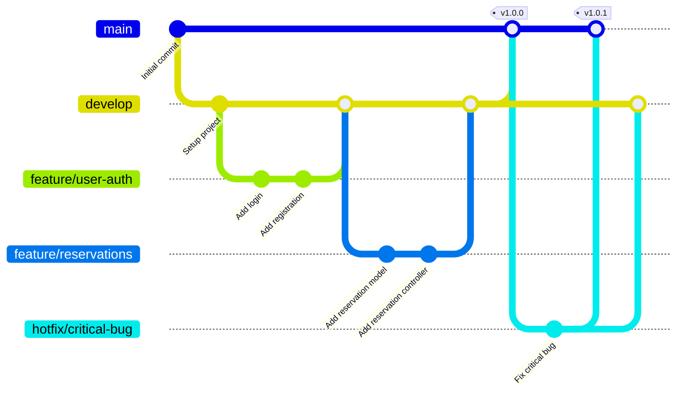

# Git Workflow Documentation

## Overview

This document outlines the Git workflow and version control practices for the Smart Parking Management System project.

## Repository Setup

### Initial Setup

```bash
# Navigate to project directory
cd parking-system-main

# Initialize Git repository (if not already done)
git init

# Add all files
git add .

# Create initial commit
git commit -m "Initial commit: Smart Parking Management System"

# Add remote repository (replace with your repository URL)
git remote add origin https://github.com/yourusername/parking-system.git

# Push to remote
git push -u origin main
```

## Branch Strategy

We follow a **Git Flow** branching model with the following branches:

### Main Branches

1. **`main`** - Production-ready code
   - Always stable and deployable
   - Protected branch (requires pull request)
   - Tagged with version numbers

2. **`develop`** - Integration branch
   - Latest development changes
   - Base branch for feature development
   - Merged into `main` for releases

### Supporting Branches

3. **`feature/*`** - New features
   - Branch from: `develop`
   - Merge back to: `develop`
   - Naming: `feature/feature-name`
   - Example: `feature/payment-integration`

4. **`bugfix/*`** - Bug fixes
   - Branch from: `develop`
   - Merge back to: `develop`
   - Naming: `bugfix/bug-description`
   - Example: `bugfix/reservation-validation`

5. **`hotfix/*`** - Critical production fixes
   - Branch from: `main`
   - Merge back to: `main` and `develop`
   - Naming: `hotfix/issue-description`
   - Example: `hotfix/payment-error`

## Branch Diagram



## Workflow Steps

### Creating a New Feature

```bash
# 1. Update develop branch
git checkout develop
git pull origin develop

# 2. Create feature branch
git checkout -b feature/new-feature-name

# 3. Make changes and commit
git add .
git commit -m "feat: add new feature description"

# 4. Push feature branch
git push origin feature/new-feature-name

# 5. Create pull request on GitHub
# (Use GitHub web interface)

# 6. After review and approval, merge to develop
# (Done via GitHub pull request)

# 7. Delete feature branch
git branch -d feature/new-feature-name
git push origin --delete feature/new-feature-name
```

### Creating a Release

```bash
# 1. Update develop branch
git checkout develop
git pull origin develop

# 2. Merge develop into main
git checkout main
git pull origin main
git merge develop

# 3. Tag the release
git tag -a v1.0.0 -m "Release version 1.0.0"

# 4. Push changes and tags
git push origin main
git push origin --tags
```

### Hotfix Workflow

```bash
# 1. Create hotfix branch from main
git checkout main
git pull origin main
git checkout -b hotfix/critical-issue

# 2. Fix the issue and commit
git add .
git commit -m "fix: resolve critical issue"

# 3. Merge back to main
git checkout main
git merge hotfix/critical-issue
git tag -a v1.0.1 -m "Hotfix version 1.0.1"
git push origin main
git push origin --tags

# 4. Merge back to develop
git checkout develop
git merge hotfix/critical-issue
git push origin develop

# 5. Delete hotfix branch
git branch -d hotfix/critical-issue
```

## Commit Message Convention

We follow the **Conventional Commits** specification for clear and consistent commit messages.

### Format

```
<type>(<scope>): <subject>

<body>

<footer>
```

### Types

- **feat**: New feature
- **fix**: Bug fix
- **docs**: Documentation changes
- **style**: Code style changes (formatting, no logic change)
- **refactor**: Code refactoring
- **test**: Adding or updating tests
- **chore**: Maintenance tasks (dependencies, build, etc.)
- **perf**: Performance improvements

### Examples

```bash
# Feature
git commit -m "feat(auth): add JWT authentication"

# Bug fix
git commit -m "fix(reservation): prevent double booking"

# Documentation
git commit -m "docs(api): update API documentation"

# Refactoring
git commit -m "refactor(models): improve query performance"

# Multiple lines
git commit -m "feat(payment): add mobile money integration

- Integrate with MTN Mobile Money API
- Add transaction verification
- Generate payment receipts

Closes #123"
```

## Pull Request Process

### Creating a Pull Request

1. **Push your branch** to the remote repository
2. **Navigate to GitHub** and create a pull request
3. **Fill in the PR template**:
   - Title: Clear, descriptive title
   - Description: What changes were made and why
   - Related issues: Link to related issues
   - Testing: How the changes were tested

### PR Template

```markdown
## Description
Brief description of the changes

## Type of Change
- [ ] Bug fix
- [ ] New feature
- [ ] Breaking change
- [ ] Documentation update

## Changes Made
- Change 1
- Change 2
- Change 3

## Testing
- [ ] Unit tests added/updated
- [ ] Integration tests added/updated
- [ ] Manual testing completed

## Checklist
- [ ] Code follows project style guidelines
- [ ] Self-review completed
- [ ] Comments added for complex code
- [ ] Documentation updated
- [ ] No new warnings generated
```

### Code Review Guidelines

**For Authors:**
- Keep PRs small and focused
- Write clear commit messages
- Add tests for new features
- Update documentation
- Respond to review comments promptly

**For Reviewers:**
- Review within 24 hours
- Be constructive and respectful
- Check code quality and logic
- Verify tests are adequate
- Approve or request changes

## Git Best Practices

### Do's ✅

1. **Commit Often**: Make small, atomic commits
2. **Write Clear Messages**: Use conventional commit format
3. **Pull Before Push**: Always pull latest changes before pushing
4. **Use Branches**: Never commit directly to `main` or `develop`
5. **Review Changes**: Review your changes before committing
6. **Keep History Clean**: Use `git rebase` for feature branches (if needed)

### Don'ts ❌

1. **Don't Commit Secrets**: Never commit `.env` files or API keys
2. **Don't Force Push**: Avoid `git push --force` on shared branches
3. **Don't Commit Large Files**: Use `.gitignore` for large files
4. **Don't Mix Concerns**: One commit should address one concern
5. **Don't Skip Tests**: Always run tests before committing

## Useful Git Commands

### Status and Information

```bash
# Check status
git status

# View commit history
git log --oneline --graph --all

# View changes
git diff

# View remote repositories
git remote -v
```

### Branch Management

```bash
# List all branches
git branch -a

# Switch to branch
git checkout branch-name

# Create and switch to new branch
git checkout -b new-branch-name

# Delete local branch
git branch -d branch-name

# Delete remote branch
git push origin --delete branch-name
```

### Undoing Changes

```bash
# Discard changes in working directory
git checkout -- filename

# Unstage file
git reset HEAD filename

# Undo last commit (keep changes)
git reset --soft HEAD~1

# Undo last commit (discard changes)
git reset --hard HEAD~1

# Revert a commit (creates new commit)
git revert commit-hash
```

### Stashing

```bash
# Stash changes
git stash

# List stashes
git stash list

# Apply latest stash
git stash apply

# Apply and remove latest stash
git stash pop

# Clear all stashes
git stash clear
```

## Conflict Resolution

### Resolving Merge Conflicts

```bash
# 1. Pull latest changes
git pull origin develop

# 2. If conflicts occur, Git will mark them
# Open conflicted files and look for:
# <<<<<<< HEAD
# Your changes
# =======
# Their changes
# >>>>>>> branch-name

# 3. Edit files to resolve conflicts

# 4. Mark as resolved
git add resolved-file

# 5. Complete the merge
git commit -m "merge: resolve conflicts with develop"
```

## GitHub Integration

### Setting Up GitHub

```bash
# Add GitHub remote
git remote add origin https://github.com/yourusername/parking-system.git

# Verify remote
git remote -v

# Push to GitHub
git push -u origin main
```

### GitHub Features to Use

1. **Issues**: Track bugs and feature requests
2. **Pull Requests**: Code review and collaboration
3. **Projects**: Kanban boards for project management
4. **Actions**: CI/CD automation (optional)
5. **Wiki**: Additional documentation
6. **Releases**: Version releases with changelogs

## Version Tagging

### Semantic Versioning

We follow **Semantic Versioning** (SemVer): `MAJOR.MINOR.PATCH`

- **MAJOR**: Incompatible API changes
- **MINOR**: New features (backwards compatible)
- **PATCH**: Bug fixes (backwards compatible)

### Creating Tags

```bash
# Create annotated tag
git tag -a v1.0.0 -m "Release version 1.0.0"

# Push tag to remote
git push origin v1.0.0

# Push all tags
git push origin --tags

# List tags
git tag -l

# Delete tag
git tag -d v1.0.0
git push origin --delete v1.0.0
```

## Collaboration Guidelines

### Team Workflow

1. **Daily**: Pull latest changes from `develop`
2. **Before Starting**: Create feature branch from `develop`
3. **During Development**: Commit regularly with clear messages
4. **Before PR**: Rebase on latest `develop` (if needed)
5. **After PR Approval**: Merge and delete feature branch
6. **Weekly**: Review and clean up old branches

### Communication

- Use PR comments for code discussions
- Link commits to issues using `#issue-number`
- Tag team members for review using `@username`
- Use GitHub Discussions for general questions

## Backup and Recovery

### Backup Strategies

```bash
# Clone repository (automatic backup)
git clone https://github.com/yourusername/parking-system.git

# Create bundle (offline backup)
git bundle create parking-system.bundle --all

# Restore from bundle
git clone parking-system.bundle parking-system-restored
```

### Recovery

```bash
# Recover deleted branch
git reflog
git checkout -b recovered-branch commit-hash

# Recover deleted commits
git reflog
git cherry-pick commit-hash
```

## Resources

### Learning Resources

- [Git Documentation](https://git-scm.com/doc)
- [GitHub Guides](https://guides.github.com/)
- [Conventional Commits](https://www.conventionalcommits.org/)
- [Git Flow](https://nvie.com/posts/a-successful-git-branching-model/)

### Tools

- **Git GUI**: GitKraken, SourceTree, GitHub Desktop
- **VS Code Extensions**: GitLens, Git Graph
- **Command Line**: Git Bash, Oh My Zsh

---

**Last Updated**: December 2025  
**Version**: 1.0.0
