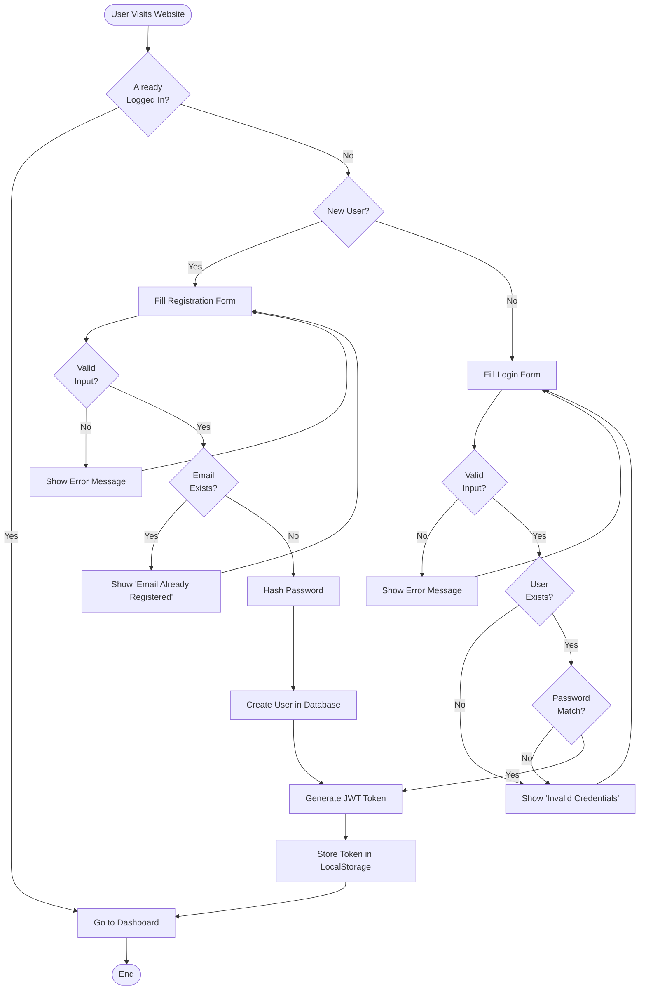
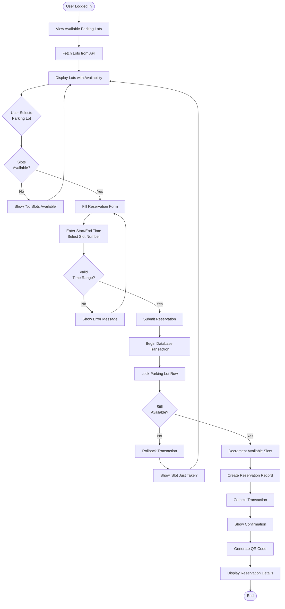
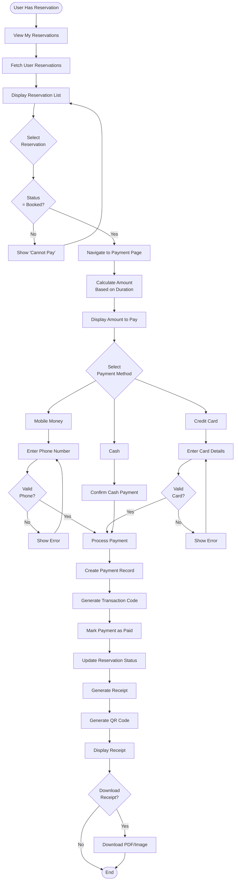
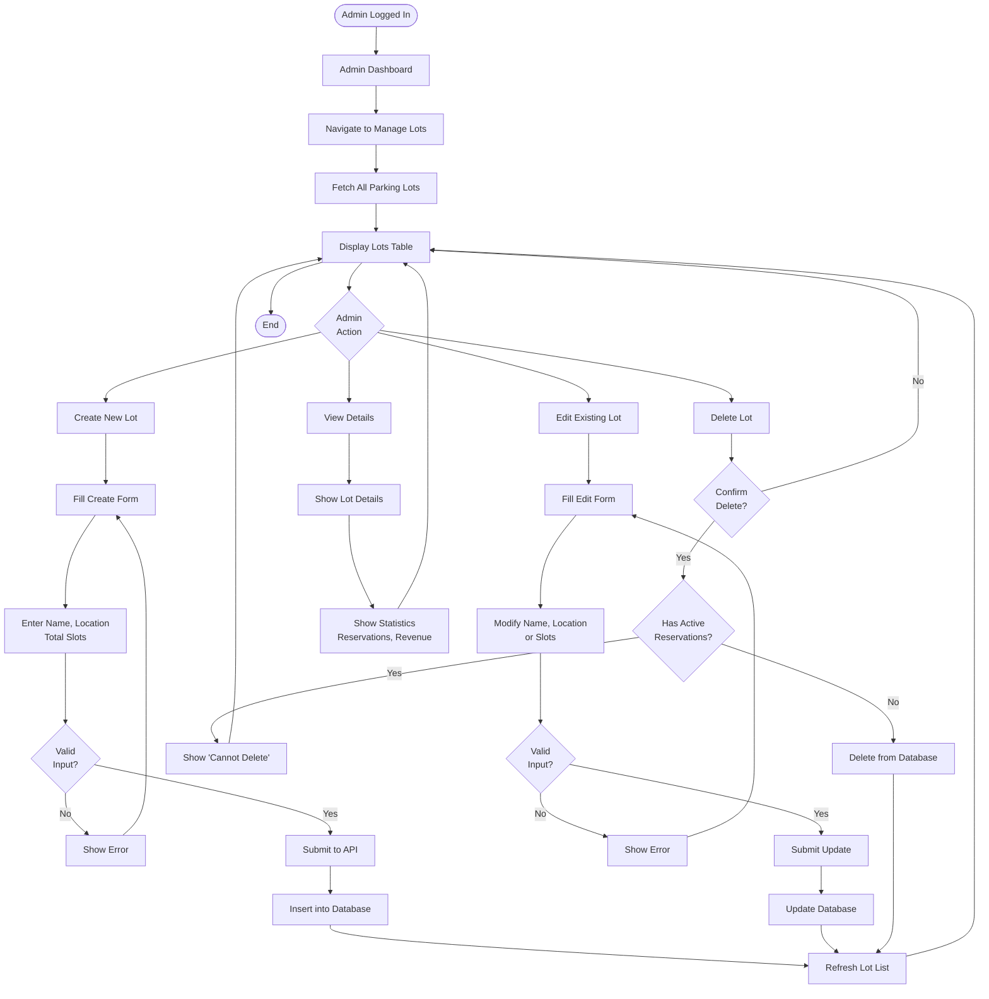
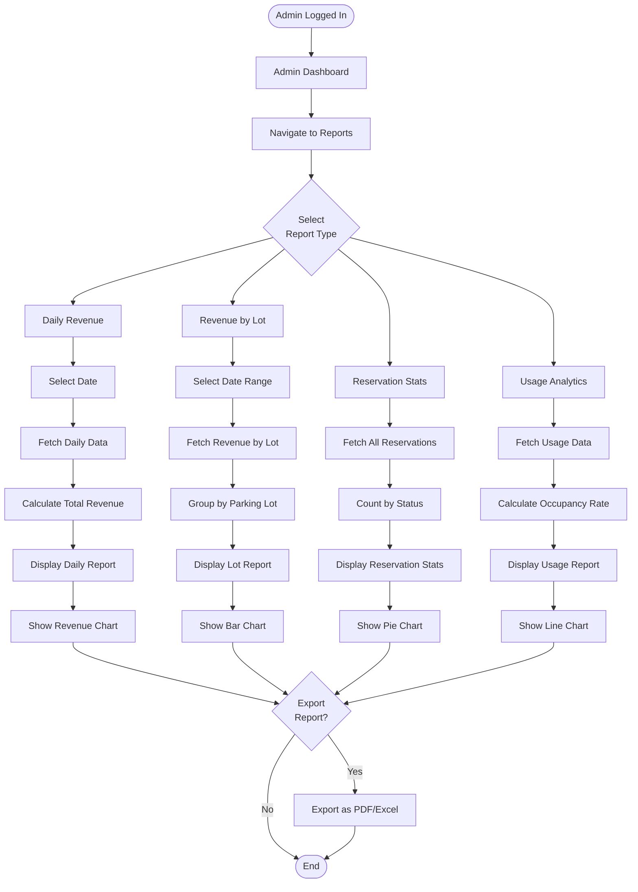
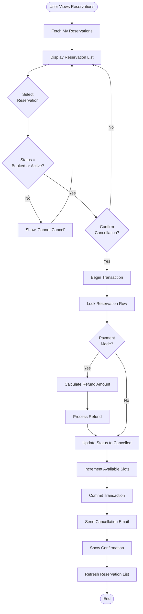

# Activity Diagrams

Activity diagrams show the workflow and business processes in the Smart Parking Management System.

## 1. User Registration and Login Process

## 2. Parking Lot Reservation Process

## 3. Payment Processing Workflow

## 4. Admin - Manage Parking Lots

## 5. Admin - View Reports and Analytics

## 6. Reservation Cancellation Process

## Key Process Insights

### Concurrency Handling

The reservation process uses **database transactions with row-level locking** to prevent race conditions:

1. **BEGIN TRANSACTION**: Start atomic operation
2. **SELECT ... FOR UPDATE**: Lock the parking lot row
3. **Check availability**: Verify slots are still available
4. **Update slots**: Decrement available_slots
5. **Create reservation**: Insert reservation record
6. **COMMIT**: Make changes permanent

This ensures that two users cannot book the same last slot simultaneously.

### Error Handling

All processes include comprehensive error handling:

- **Validation Errors**: Input validation before processing
- **Business Logic Errors**: Check business rules (e.g., slot availability)
- **Database Errors**: Handle transaction failures with rollback
- **User Feedback**: Clear error messages for all failure scenarios

### State Management

Reservation states:
- **booked**: Initial state after creation
- **active**: User has checked in
- **completed**: Parking session finished
- **cancelled**: User or admin cancelled

Payment states:
- **pending**: Payment initiated
- **paid**: Payment successful
- **failed**: Payment failed
- **refunded**: Payment refunded after cancellation

---

**Note**: These activity diagrams represent the core business processes. Each process includes proper error handling, validation, and user feedback mechanisms.
