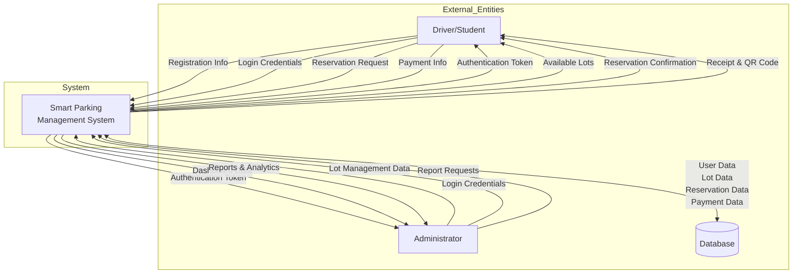
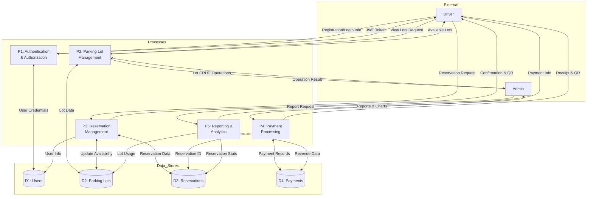
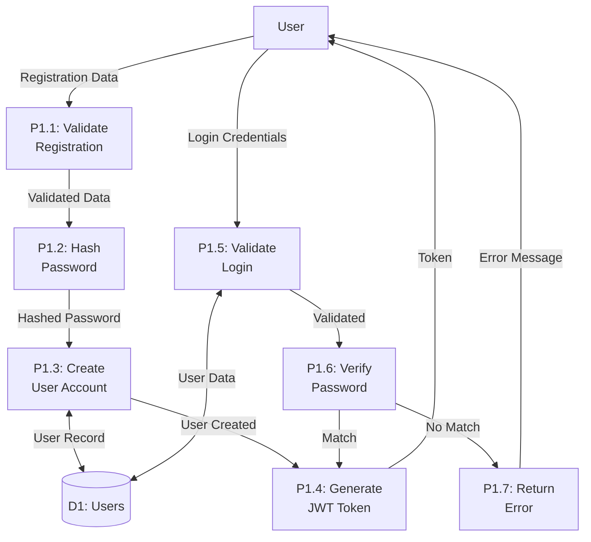
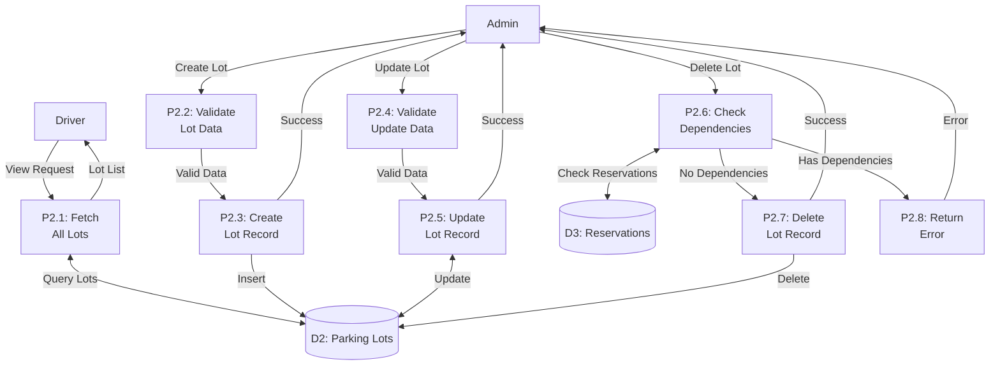
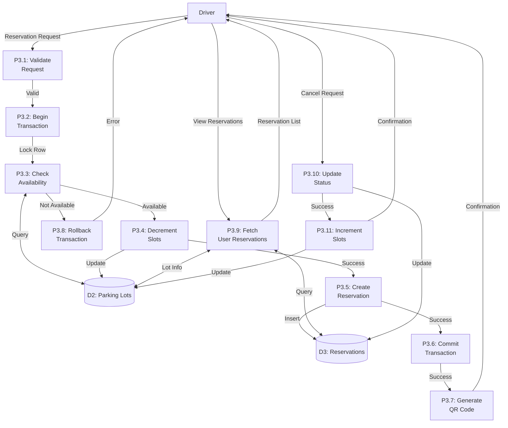
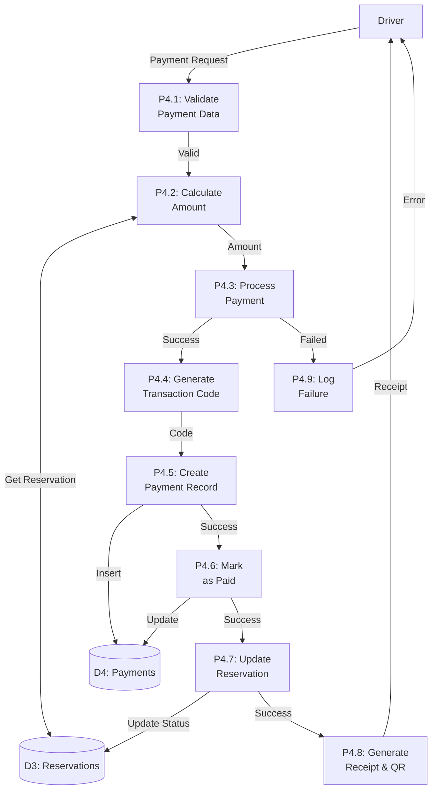
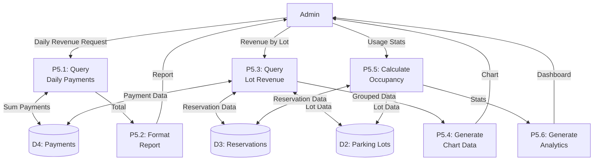

# Data Flow Diagrams (DFD)

Data Flow Diagrams show how data moves through the Smart Parking Management System.

## Level 0: Context Diagram

The context diagram shows the system as a single process with external entities.



## Level 1: Major Processes

This diagram breaks down the system into major functional processes.



## Level 2: Detailed Process Breakdown

### 2.1 Authentication & Authorization Process (P1)



### 2.2 Parking Lot Management Process (P2)



### 2.3 Reservation Management Process (P3)



### 2.4 Payment Processing Process (P4)



### 2.5 Reporting & Analytics Process (P5)



## Data Store Specifications

### D1: Users

| Field | Type | Description |
|-------|------|-------------|
| id | Integer | Primary key |
| name | String | User full name |
| email | String | Unique email address |
| password | String | Hashed password |
| role | String | 'driver' or 'admin' |
| phone_number | String | Contact number |
| created_at | Timestamp | Registration date |

**Inputs**: Registration data, login credentials  
**Outputs**: User profile, authentication data  
**Processes**: P1 (Authentication)

### D2: Parking Lots

| Field | Type | Description |
|-------|------|-------------|
| id | Integer | Primary key |
| name | String | Lot name |
| location | String | Physical location |
| total_slots | Integer | Total parking spaces |
| available_slots | Integer | Currently available |
| created_at | Timestamp | Creation date |

**Inputs**: Lot management data, availability updates  
**Outputs**: Available lots, lot details  
**Processes**: P2 (Lot Management), P3 (Reservations), P5 (Reports)

### D3: Reservations

| Field | Type | Description |
|-------|------|-------------|
| id | Integer | Primary key |
| user_id | Integer | Foreign key to users |
| lot_id | Integer | Foreign key to parking_lots |
| slot_number | String | Specific slot |
| start_time | Timestamp | Reservation start |
| end_time | Timestamp | Reservation end |
| status | String | Reservation state |
| created_at | Timestamp | Creation date |

**Inputs**: Reservation requests, status updates  
**Outputs**: Reservation list, confirmation  
**Processes**: P3 (Reservations), P4 (Payments), P5 (Reports)

### D4: Payments

| Field | Type | Description |
|-------|------|-------------|
| id | Integer | Primary key |
| reservation_id | Integer | Foreign key to reservations |
| amount | Decimal | Payment amount |
| method | String | Payment method |
| status | String | Payment status |
| transaction_code | String | Unique transaction ID |
| payment_time | Timestamp | Payment timestamp |
| created_at | Timestamp | Creation date |

**Inputs**: Payment information  
**Outputs**: Receipts, revenue data  
**Processes**: P4 (Payments), P5 (Reports)

## Data Flow Summary

### Input Data Flows

1. **User Registration**: name, email, password, phone → System
2. **Login**: email, password → System
3. **Reservation Request**: lot_id, start_time, end_time → System
4. **Payment**: reservation_id, amount, method → System
5. **Lot Management**: name, location, total_slots → System

### Output Data Flows

1. **Authentication**: JWT token → User
2. **Available Lots**: lot list with availability → User
3. **Reservation Confirmation**: reservation details, QR code → User
4. **Receipt**: payment details, QR code → User
5. **Reports**: revenue data, analytics, charts → Admin

### Internal Data Flows

1. **User Data**: P1 ↔ D1
2. **Lot Data**: P2 ↔ D2, P3 ↔ D2
3. **Reservation Data**: P3 ↔ D3, P4 ↔ D3
4. **Payment Data**: P4 ↔ D4, P5 ↔ D4

## Data Transformation Examples

### Example 1: User Registration

**Input**: 
```json
{
  "name": "John Doe",
  "email": "john@university.edu",
  "password": "myPassword123",
  "phone": "+250788123456"
}
```

**Transformation**:
1. Validate email format
2. Hash password: `myPassword123` → `$2a$10$...hashed...`
3. Set default role: `driver`

**Output to Database**:
```json
{
  "id": 1,
  "name": "John Doe",
  "email": "john@university.edu",
  "password": "$2a$10$...hashed...",
  "role": "driver",
  "phone_number": "+250788123456",
  "created_at": "2025-12-03T10:00:00Z"
}
```

**Output to User**:
```json
{
  "user": {
    "id": 1,
    "name": "John Doe",
    "email": "john@university.edu",
    "role": "driver"
  },
  "token": "eyJhbGciOiJIUzI1NiIsInR5cCI6IkpXVCJ9..."
}
```

### Example 2: Reservation Creation

**Input**:
```json
{
  "lot_id": 2,
  "start_time": "2025-12-03T08:00:00Z",
  "end_time": "2025-12-03T17:00:00Z",
  "slot_number": "A12"
}
```

**Transformation**:
1. Verify lot exists and has availability
2. Calculate duration: 9 hours
3. Decrement available_slots: 50 → 49
4. Set status: `booked`

**Output to Database (Reservation)**:
```json
{
  "id": 101,
  "user_id": 1,
  "lot_id": 2,
  "slot_number": "A12",
  "start_time": "2025-12-03T08:00:00Z",
  "end_time": "2025-12-03T17:00:00Z",
  "status": "booked",
  "created_at": "2025-12-03T07:30:00Z"
}
```

**Output to User**:
```json
{
  "reservation": {
    "id": 101,
    "lot_name": "Main Campus Parking",
    "location": "Building A",
    "slot_number": "A12",
    "start_time": "2025-12-03T08:00:00Z",
    "end_time": "2025-12-03T17:00:00Z",
    "status": "booked"
  },
  "qrCode": "data:image/png;base64,iVBORw0KGgoAAAANS..."
}
```

---

**Note**: These DFDs represent the logical flow of data through the system. Physical implementation may include additional layers like caching, load balancing, and API gateways.
