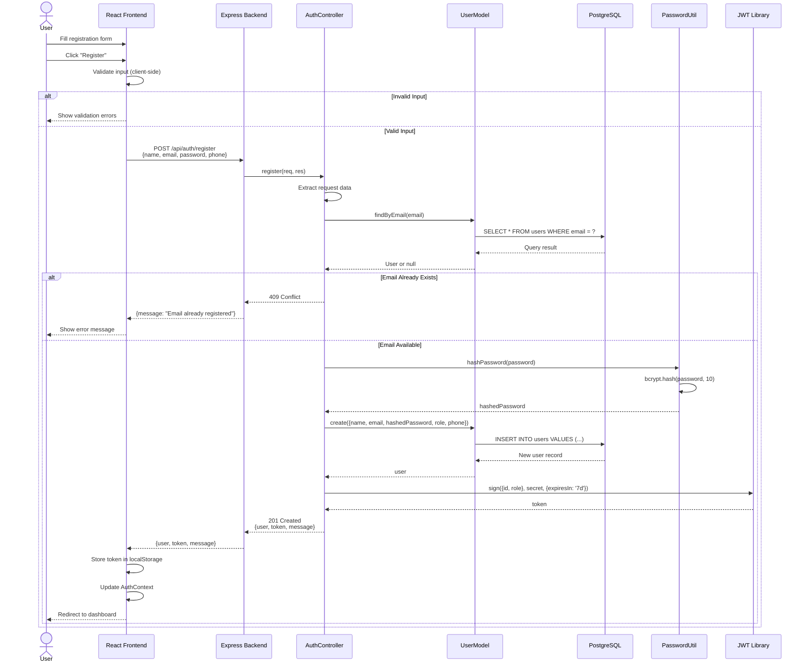
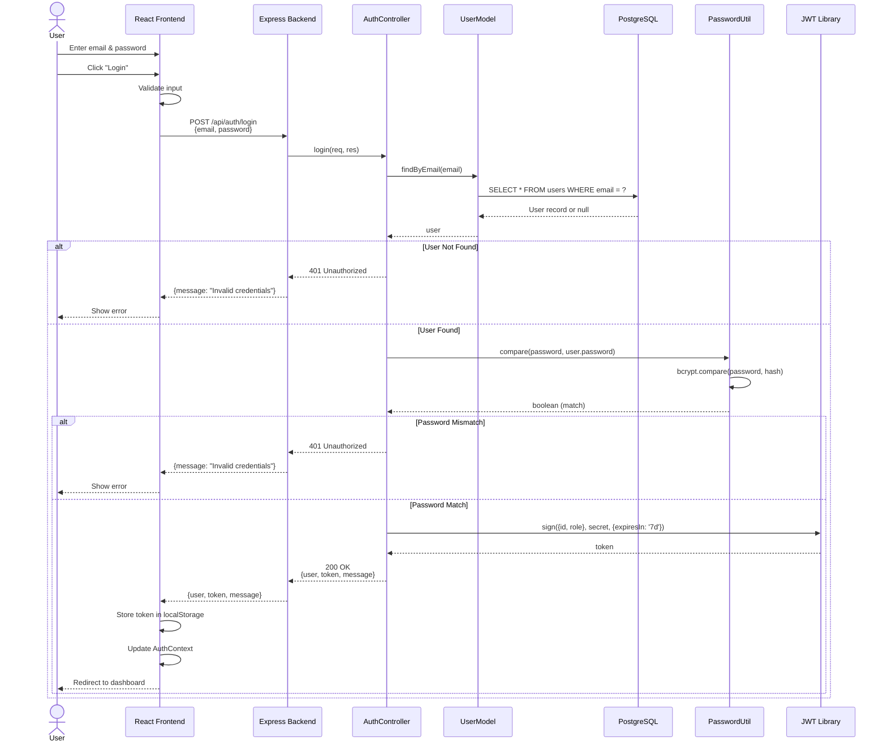
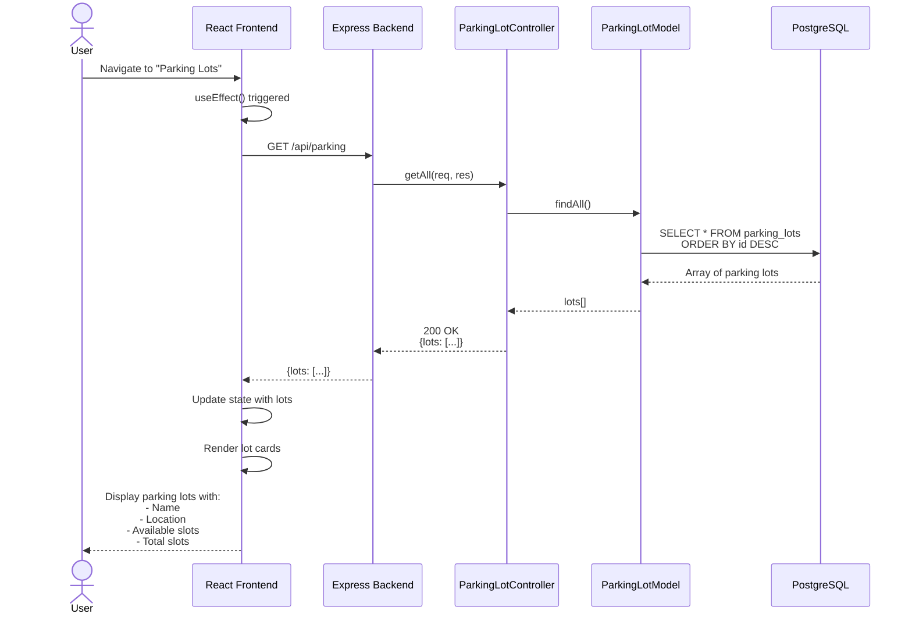
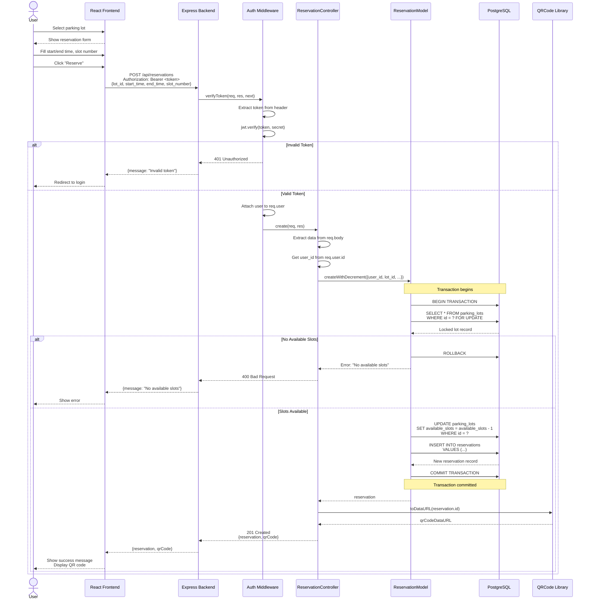
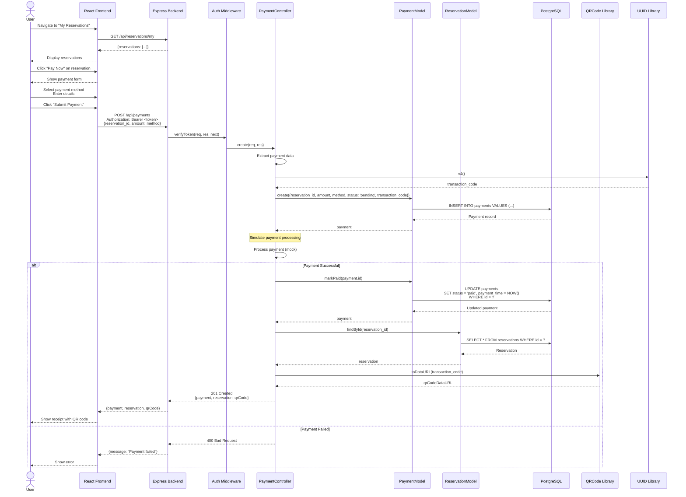
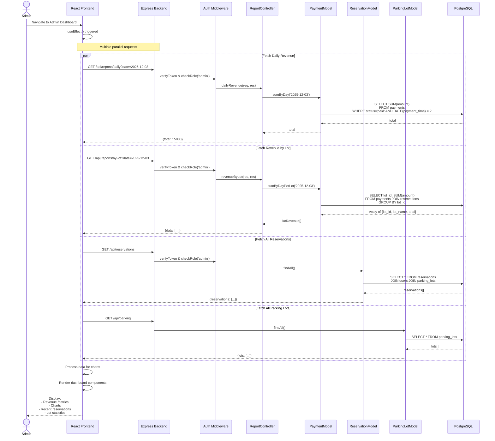
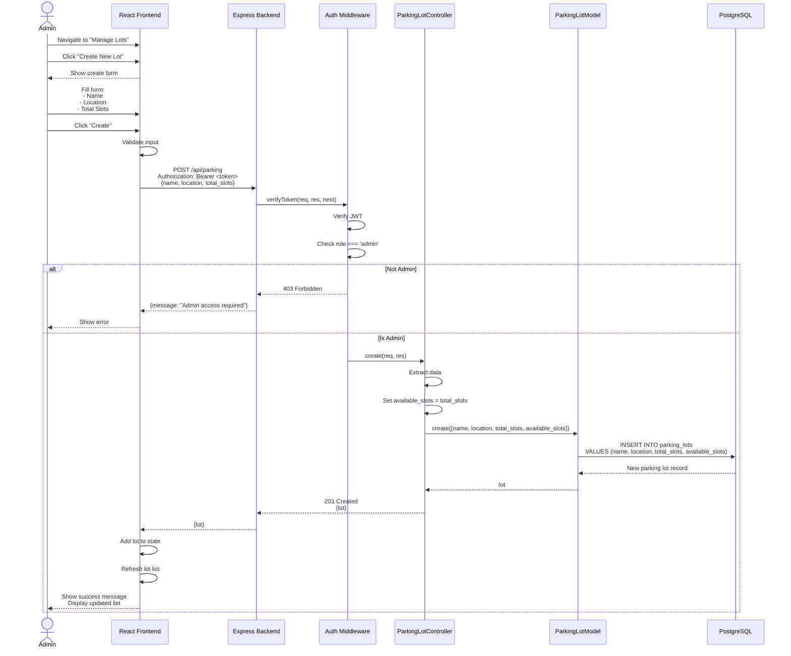
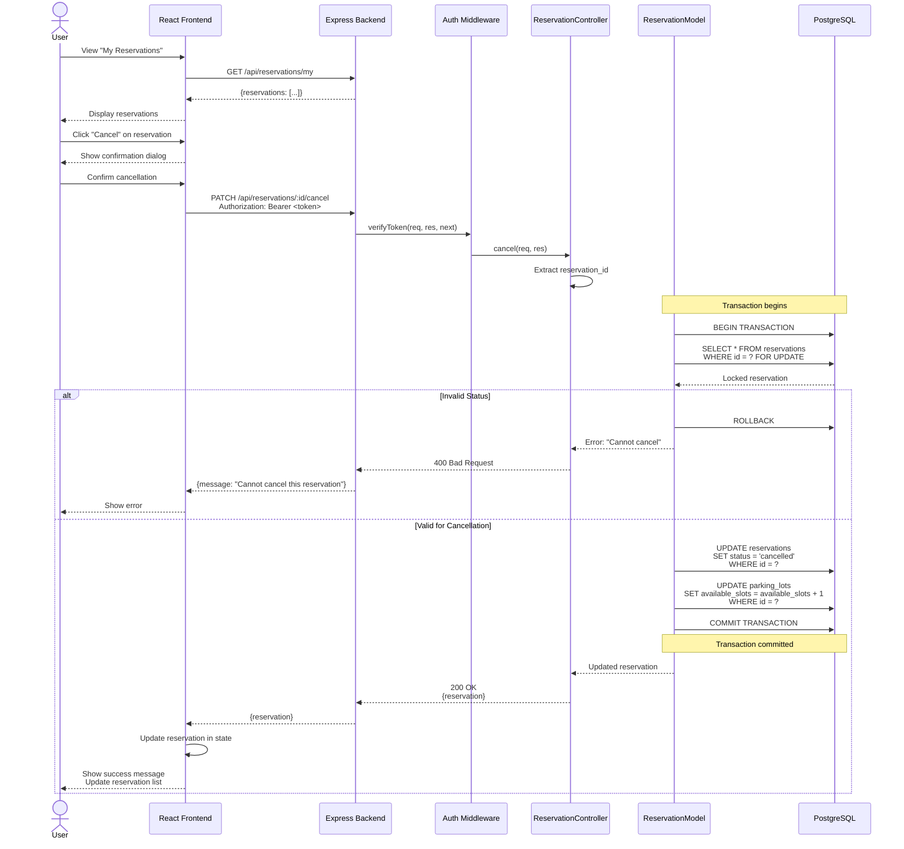

# Sequence Diagrams

Sequence diagrams show the interaction between different components over time in the Smart Parking Management System.

## 1. User Registration Sequence

## 2. User Login Sequence

## 3. View Available Parking Lots Sequence

## 4. Create Parking Reservation Sequence

## 5. Payment Processing Sequence

## 6. Admin Dashboard Data Loading Sequence

## 7. Admin Create Parking Lot Sequence

## 8. Reservation Cancellation Sequence

## Key Interaction Patterns

### 1. Authentication Pattern

All protected endpoints follow this pattern:
1. Frontend sends request with `Authorization: Bearer <token>` header
2. Middleware extracts and verifies JWT token
3. Middleware attaches user info to `req.user`
4. Controller accesses user data via `req.user.id` or `req.user.role`

### 2. Transaction Pattern

Critical operations use database transactions:
1. `BEGIN TRANSACTION`
2. `SELECT ... FOR UPDATE` (row-level lock)
3. Validate business rules
4. Perform updates
5. `COMMIT` or `ROLLBACK`

### 3. Error Handling Pattern

Consistent error responses:
- **400 Bad Request**: Invalid input
- **401 Unauthorized**: Missing/invalid token
- **403 Forbidden**: Insufficient permissions
- **404 Not Found**: Resource doesn't exist
- **409 Conflict**: Duplicate resource
- **500 Internal Server Error**: Server error

### 4. Response Pattern

Successful responses include:
- **200 OK**: Successful GET/PATCH/DELETE
- **201 Created**: Successful POST
- Response body: `{data, message}` or `{resource}`

---

**Note**: These sequence diagrams show the happy path and common error scenarios. Additional error handling exists in the actual implementation.
